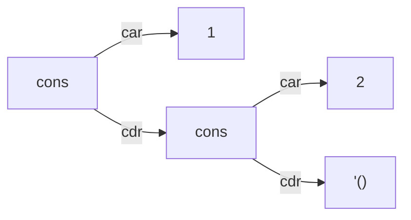

# はじめに

## なぜ「もう一冊」の DrRacket 本が必要か

Racket 公式ドキュメントは非常に良質です。特に *The Racket Guide* は言語のほとんどの機能を丁寧に網羅していて、英語が読めるなら最終的にはこれを読むのが最短です。しかし、次のような読者には **途中で息切れしがち** です。

- 「Lisp 系は初めてなので、まず **S式・前置記法・再帰という文化** に慣れたい」
- 「DrRacket の画面を触りながら、手を動かして進めたい」
- 「日本語で、**手触りのある例** が読みたい」

本書はこの隙間を埋めるために書かれました。具体的には次の方針を取ります。

1. **他言語経験者との差分** を毎章意識する。「Python だったらこう書くが、Racket ではこう考える」という翻訳を挟む。
2. **コードと出力を必ずペアで示す**。書いてあるコードがどのような出力を生むのか、実際に筆者の環境で実行した結果を貼っている。
3. **Mermaid 図** を使って、評価順序や再帰の展開、データの変化を視覚化する。
4. **章ごとに手を動かす課題** を置く。答えは別ファイルに用意する。

## 本書のスタイル

### コード表記

```racket
(define (square x) (* x x))
(square 7)
;; => 49
```

行頭の `;;` で始まるコメントは、**その直前の式を評価した結果** を示す Racket 界隈でよく使われる慣習です。本書でもそれを採用します。

REPL とのやり取りはプロンプト付きで示します。

```text
> (+ 1 2 3)
6
> (define x 10)
> (* x x)
100
```

### 図の表記

データ構造や評価の流れは Mermaid で描きます。たとえばコンスセル `(cons 1 (cons 2 '()))` は次のように描けます。



GitHub の Markdown ビューは Mermaid をそのまま描画します。もし自分のエディタで見えない場合は GitHub で開いてみてください。

### 用語

本書で使う重要な言葉を最初にまとめておきます。読み進めるうちに意味が染み込むので、今は軽く眺めるだけで構いません。

| 用語 | 英語 | 本書での意味 |
| --- | --- | --- |
| 式 | expression | 評価すると値を返すもの。Lisp ではほぼすべてが式 |
| 値 | value | 数値、文字列、リスト、関数など、式を評価した結果 |
| S式 | S-expression | 括弧で囲まれた木構造のテキスト表現 |
| フォーム | form | `define` や `if` のような、評価規則が特別な構文 |
| 手続き | procedure | 関数のこと(Scheme 系の伝統的呼び方) |
| REPL | Read-Eval-Print Loop | 対話環境 |

### 動作確認

本書のコードはすべて以下の環境で動作確認しています。

- Racket v8.10 (CS)
- OS: Ubuntu 24.04

バージョンが大きく違うときは、読者の環境でも動くか各章冒頭の `#lang` 宣言で確認してください。

## 本書を読むのに必要な前提

次のことが一度でもあれば十分です。

- 他の言語で関数を定義したことがある
- `if` 文や `for` ループを書いたことがある
- 配列やリストにアクセスしたことがある

次のことは **知らなくても大丈夫** です。

- 関数型プログラミング
- Scheme / Common Lisp / Clojure / Emacs Lisp
- 末尾再帰、モナド、代数的データ型などの専門用語

章が進むにつれて、これらが自然に手に馴染んでいくはずです。

## フィードバック

本書は筆者が自分用にまとめたノートをベースにしているため、誤記や不明瞭な記述が残っている可能性があります。気づいたら [GitHub リポジトリ](https://github.com/hama-jp/drracket-japanese-tutoria) の Issue / Pull Request で教えてもらえるととても助かります。

それでは、次章で **Racket と Lisp の地図** を広げるところから始めましょう。
