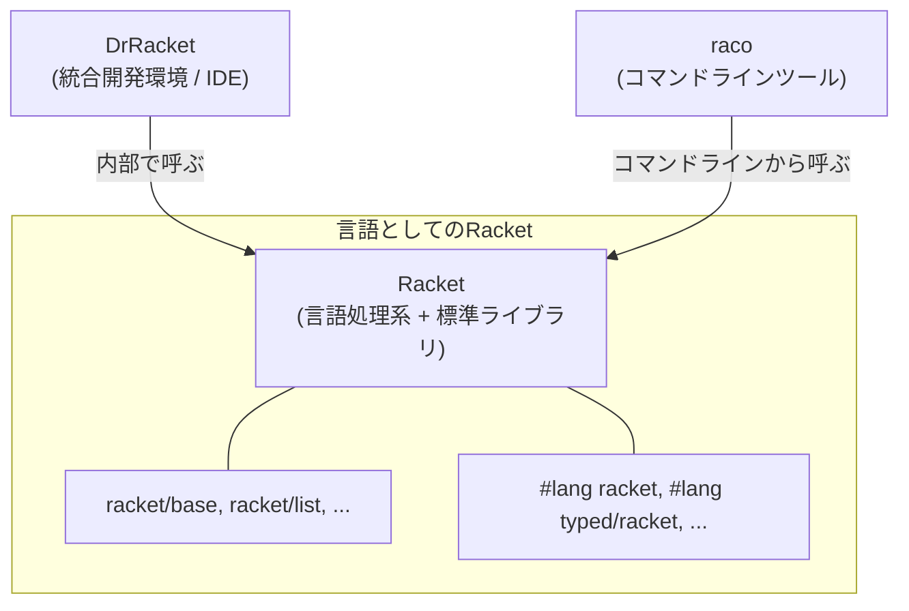
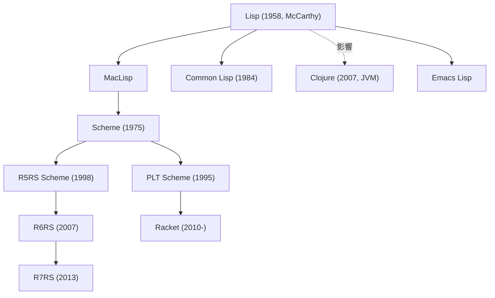

# 第 1 章 DrRacket / Racket / Lisp の地図

最初に地図を広げておきます。これから長い旅に出るにあたって、**Racket がどの位置に立っているのか** を把握しておくと迷子になりません。

## 1.1 DrRacket と Racket は別物

ざっくり言うと次の関係です。



- **Racket(言語)**: Scheme 系 Lisp から派生した言語そのもの。 `racket` コマンドで起動できる
- **DrRacket**: Racket の公式 IDE。エディタ・デバッガ・REPL が統合されている
- **raco**: パッケージ管理・テスト・コンパイルなどを担うコマンドラインツール

DrRacket なしでも Racket でプログラムは書けますし、逆に DrRacket だけ覚えても Racket の強みは引き出せません。本書では両方を並行して使います。

## 1.2 Lisp ファミリーの中の Racket

他言語経験者がよく戸惑うのが「Scheme と Lisp と Racket と Clojure は何が違うのか」問題です。簡単な系図を描いておきます。



本書の立ち位置をまとめると次の通り。

- Racket は **Scheme の親戚** だが、互換性を捨てて自前の進化を選んだ言語
- R5RS/R6RS Scheme のプログラムは **ほぼ** そのまま動くが、慣用句は違う
- Common Lisp とは文法的にかなり違う(`t`/`nil` ではなく `#t`/`#f` や `'()`)
- Clojure とは見た目以上に別物(Racket は JVM に乗らない、可変性の扱いも違う)
- Emacs Lisp とはほぼ別言語と思ってよい

## 1.3 なぜ今 Racket を学ぶのか

Lisp は「学習用」で実務には使われないと誤解されがちですが、Racket を学ぶ実利はきちんとあります。

1. **「言語を作る言語」として設計されている**
   `#lang` という仕組みで、Racket の上に独自の文法・意味論を持つ言語を載せられる。教科書 *How to Design Programs* で使われる `#lang htdp/bsl` や、静的型付けの `#lang typed/racket` はその例。
2. **マクロが一級市民**
   `define-syntax` と `syntax-parse` で、コンパイル時に自分のコードを自分で書き換えられる。他言語のメタプログラミングよりはるかに安全かつ強力。
3. **教育に徹底的に鍛えられている**
   Northeastern 大学などで長年教材として磨かれてきたため、エラーメッセージ・IDE・デバッガが初心者に優しい。
4. **関数型の基礎体力がつく**
   末尾再帰・クロージャ・高階関数・継続・遅延評価 — モダン言語で部分的に取り入れられている概念を、**原典の形** で学べる。

一方で Racket は以下のような用途には向いていません。

- スマホアプリのネイティブ開発
- 機械学習のような巨大数値計算(Python のエコシステムに勝てない)
- JavaScript 必須の Web フロント(Racket→JS の方法はあるが主流ではない)

本書では Racket の **強みが活きる領域** を重点的に扱います。

## 1.4 「括弧が多い」問題に先回り答えておく

Lisp に挫折する最大の理由は括弧です。先に結論を書いておきます。

- 括弧は **邪魔ではなく、構文そのものを可視化している**
- DrRacket が対応する括弧をハイライトし、`Alt+→` / `Alt+←` で括弧単位で動ける
- 慣れると **括弧が見えなくなる**。人間は字下げで木構造を読むようになる

比較してみましょう。同じ計算を複数の言語で書いてみます。

```python
# Python
result = sum(x * x for x in [1, 2, 3, 4, 5] if x % 2 == 1)
```

```javascript
// JavaScript
const result = [1, 2, 3, 4, 5]
  .filter(x => x % 2 === 1)
  .map(x => x * x)
  .reduce((a, b) => a + b, 0);
```

```racket
; Racket
(define result
  (for/sum ([x (in-list '(1 2 3 4 5))]
            #:when (odd? x))
    (* x x)))
```

どれも読めば同じことをしているとわかります。Racket だけが括弧で気持ち悪い、というほどの差はないはずです(信じてください、数章読むころには慣れます)。

## 1.5 この本で到達する場所

最終章まで読み終わるころには、あなたは次のことができるようになっています。

- 他言語から Racket に翻訳しながらコードを書ける
- 再帰・高階関数・クロージャを自然な道具として使える
- `struct` と `match` でデータ中心のコードを書ける
- `rackunit` と `contract-out` で堅牢なモジュールを作れる
- 画像 DSL を設計・実装できる
- **自分で小さな Lisp インタプリタを書ける**
- マクロの初歩を理解し、定型コードを減らすシンプルなマクロを書ける
- 公式ドキュメント(*The Racket Reference*)を恐れず読める

それでは、次の章で DrRacket をインストールし、最初のプログラムを書いてみましょう。

---

## 手を動かしてみよう(ウォームアップ)

本章に手を動かす課題はありません。その代わり、次の章に進む前に Racket 公式サイトを一度開いてみてください。

- <https://racket-lang.org/>
- <https://docs.racket-lang.org/>

「公式ドキュメントはいずれ必ず読む場所」 という感覚を持っておくと、この先の学習がスムーズになります。
