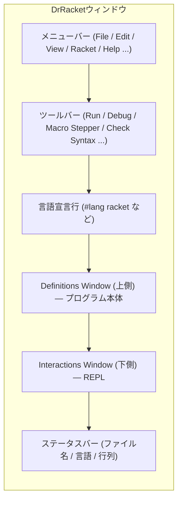

# 第 2 章 DrRacket のインストールと画面ツアー

この章では Racket と DrRacket を入れ、画面の各部分の役割を把握します。この章の終わりには「ウィンドウのこの場所で何が起きているのか」が迷わず言えるようになっているはずです。

## 2.1 インストール

### 2.1.1 公式インストーラ(推奨)

OS にかかわらず、もっとも素直な方法は <https://download.racket-lang.org/> から公式インストーラを落とすことです。

- **Windows**: `.exe` をダブルクリック
- **macOS**: `.dmg` を開いて DrRacket.app をアプリケーションフォルダへ
- **Linux**: `.sh` を実行(権限は付与が必要)

注意点:

- CS 版(Chez Scheme バックエンド)と BC 版(バイトコード VM 版)がありますが、**特に理由がなければ CS 版** を選んでください。本書の例はすべて CS 版を前提にしています。
- インストール先は後で `raco` コマンドが PATH から見える場所にしておきます。

### 2.1.2 パッケージマネージャを使う

OS のパッケージマネージャから入れる場合、バージョンが古いことがあります。

```bash
# Ubuntu / Debian
sudo apt install racket
# macOS (Homebrew)
brew install --cask racket
# Arch Linux
sudo pacman -S racket
```

インストール後、確認します。

```text
$ racket --version
Welcome to Racket v8.10 [cs].
```

`[cs]` の表記があれば CS 版です。バージョン番号は 8.x 系であれば本書の例はほぼ動作します。

### 2.1.3 DrRacket の起動

- Windows / macOS はアプリ一覧から起動
- Linux は `drracket` コマンドで起動

起動に数秒かかりますが、これは DrRacket 自体が Racket で書かれているためです(自己ホスト型の IDE は珍しい部類に入ります)。

## 2.2 DrRacket の画面構成

起動直後の DrRacket は大雑把に次の領域に分かれています。



### 2.2.1 Definitions Window(上側)

プログラム本体を書くエディタです。ここに書かれた内容は **そのままファイルとして保存される** コードです。1 行目には必ず **言語宣言行** が入ります。

```racket
#lang racket
```

`#lang` は「これから書くファイルはこの言語で解釈してね」という宣言です。`#lang racket` は「フル機能の Racket」、`#lang racket/base` は「軽量の Racket」、`#lang typed/racket` は「静的型付きの Racket」……というふうに切り替えます。詳しくは第 3 章で触れます。

### 2.2.2 Interactions Window(下側)

REPL(Read-Eval-Print Loop)です。上のエディタを `Run` で評価すると、Definitions Window の定義がすべて読み込まれた状態でこの REPL が使えるようになります。

```text
Welcome to DrRacket, version 8.10 [cs].
Language: racket, with debugging; memory limit: 128 MB.
> (+ 1 2)
3
>
```

ここで「`> `」で始まる行がユーザの入力、続く行が評価結果です。本書ではこの表記を多用します。

### 2.2.3 ツールバーのボタン

主要なボタンを押さえましょう。

| ボタン | 動き | ショートカット |
| --- | --- | --- |
| **Run** | Definitions Window を評価し REPL を更新 | `Ctrl+R` / `⌘R` |
| **Debug** | ステップ実行デバッガを起動 | `Ctrl+F5` |
| **Check Syntax** | 変数束縛を矢印で可視化 | `Ctrl+F` |
| **Macro Stepper** | マクロ展開をステップ可視化 | — |
| **Stop** | 実行中のプログラムを中断 | `Ctrl+.` |

Lisp 系の IDE としては非常にリッチで、**Check Syntax** は本書で何度も使います。

### 2.2.4 Language ダイアログ

`Language` メニュー → `Choose Language...` を開くと、`#lang` 宣言なしで使える言語を切り替えられます。デフォルトは「Use the language declared in the source」になっていて、ソースの `#lang` 行を見て自動で判断します。初心者向けの `Beginning Student` 系(HtDP 言語)にも切り替えられますが、本書では **常にソースの `#lang` に従うモード** を使います。

## 2.3 最初の設定(任意だが推奨)

DrRacket は細かく設定できますが、最低限押さえておくと快適です。

1. **Edit → Preferences → General → Editing** で、`Indenting` の好みを確認。標準で問題ないはず。
2. **Editing → Color** で **Rainbow Parentheses** を有効化。括弧の対応が色で分かるのは想像以上に効きます。
3. **Editing → Font** は好みで。日本語を含むコメントを書くなら Noto Sans CJK などを指定。

## 2.4 コマンドラインツール `racket` / `raco`

DrRacket を使わずに、ターミナルからも Racket を動かせます。

```text
$ racket
Welcome to Racket v8.10 [cs].
> (+ 1 2)
3
> (exit)
$
```

ファイルを実行するには:

```text
$ cat hello.rkt
#lang racket
(displayln "hello, racket")
$ racket hello.rkt
hello, racket
```

`raco` はパッケージ管理・ドキュメント検索・テスト実行などの万能コマンドです。よく使うもの:

```text
raco pkg install <パッケージ名>   # パッケージを入れる
raco test <ファイル/ディレクトリ> # テストを走らせる
raco docs <検索語>                # HTMLドキュメントを開く
raco make <ファイル>              # .zo にコンパイル(起動高速化)
```

Racket のドキュメントは `raco docs` で引けるのが強力で、IDE から離れて端末だけでも学習を進められます。

## 2.5 (補足)エディタ派のための選択肢

DrRacket 以外で書きたい人向けの情報です。本書は DrRacket を前提にしますが、並行して別エディタを使うのも構いません。

- **VS Code**: Magic Racket 拡張。LSP 対応。
- **Emacs**: Racket Mode (`racket-mode`)。REPL と編集が同一バッファ。
- **Vim/Neovim**: vim-racket + conjure などで REPL 連携。

ただし **Check Syntax の矢印表示** と **Macro Stepper** は DrRacket 独自の機能で、学習中はこちらで動かすことを強くお勧めします。

---

## 手を動かしてみよう

1. DrRacket を起動し、Definitions Window に次のコードを書いて `Run` してください。

    ```racket
    #lang racket
    (define (greet name)
      (string-append "こんにちは、" name "さん!"))
    (greet "レキ")
    ```

    REPL 側に `"こんにちは、レキさん!"` が表示されれば成功です。
2. `Check Syntax` を押し、`name` の束縛が `greet` の引数から `string-append` の引数まで矢印で繋がっていることを確認してください。
3. ターミナルから同じファイルを `racket greet.rkt` で実行し、`"こんにちは、レキさん!"`(ダブルクォート付き)が表示されることを確認してください。DrRacket の REPL に出た表示とほぼ同じですが、微妙に違います(クォートの扱い)。この違いは第 3 章で詳しく扱います。

次の章ではこの違いを含め、**「ファイル実行と REPL の評価モデル」** を詳しく見ていきます。
