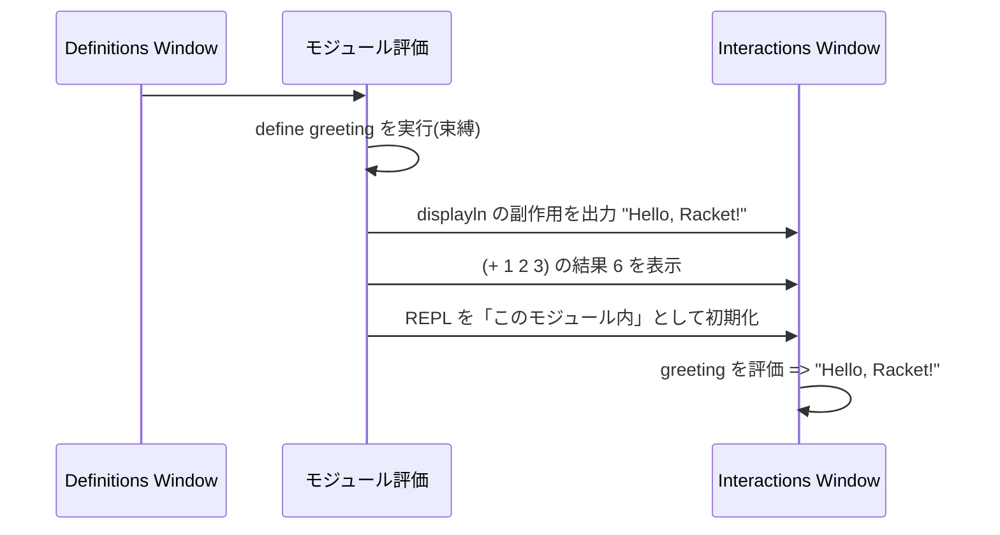

# 第 3 章 はじめてのプログラム

この章では「`Run` を押したときに何が起きているのか」を、順を追って分解します。ここを雰囲気で流さず腑に落としておくと、後で詰まったときのデバッグが格段に楽になります。

## 3.1 `#lang` 宣言 — すべての始まり

Racket のファイルは必ず `#lang` から始まります。

```racket
#lang racket
(+ 1 2 3)
```

`#lang racket` は「このファイルは `racket` という言語で解釈してほしい」という宣言です。Racket 処理系はこの 1 行目だけを特別扱いし、「じゃあ `racket` のリーダを使って残りをパースします」と切り替えます。

つまり `#lang` 行は **言語の切り替えスイッチ** です。Racket には最初から多くの `#lang` が付属しています。

| 言語宣言 | 特徴 |
| --- | --- |
| `#lang racket` | フル機能。本書の標準。 |
| `#lang racket/base` | 起動高速・最小限。大規模モジュールやライブラリでよく使う。 |
| `#lang typed/racket` | 静的型付き Racket。 |
| `#lang scribble/manual` | ドキュメント生成用の語彙(本書のドキュメントもこれで書ける)。 |
| `#lang htdp/bsl` | 教科書 *How to Design Programs* 用の入門言語。 |
| `#lang br/quicklang` | 新しい言語を作る用のスターターキット。 |

**この切り替えが Racket 最大の個性** です。詳しくは第 16 章以降で扱います。

## 3.2 `Run` を押したときに起きること

Definitions Window に次のコードを書いて `Run` を押してみましょう。

```racket
#lang racket
(define greeting "Hello, Racket!")
(displayln greeting)
(+ 1 2 3)
```

Interactions Window(REPL)にはこう表示されます。

```text
Hello, Racket!
6
>
```

一方、REPL に `greeting` とだけ入れると:

```text
> greeting
"Hello, Racket!"
> (+ 1 2 3)
6
```

起きたことを分解します。



ポイント:

- Definitions Window のコードは **1つのモジュール** として一括で評価される
- `define` は「値を束縛する」だけで、評価結果の **値そのものは表示されない**
- トップレベルに裸で書かれた式(`(+ 1 2 3)` など)は評価結果が **REPL に印字される**
- REPL はそのモジュールの「内側」に入った状態になり、`greeting` にアクセスできる

## 3.3 `print`, `write`, `display` の違い

REPL ではクォート付き、`displayln` だとクォートなし。これは意図的な使い分けがあります。

次の REPL セッションで確かめます。

```text
> (print "hello")
"hello"
> (write "hello")
"hello"
> (display "hello")
hello
> (print '(1 2 "a"))
'(1 2 "a")
> (write '(1 2 "a"))
(1 2 "a")
> (display '(1 2 "a"))
(1 2 a)
```

役割はざっくり次の通りです。

| 関数 | 目的 | 特徴 |
| --- | --- | --- |
| `print` | 人間にもプログラムにも読める "Racket リテラル" を出す | `'(1 2)` のようにクォート付きで出る |
| `write` | **`read` で読み戻せる** 表現 | Racket 間のシリアライズに向く |
| `display` | **人間向け** の表示 | クォートや括弧が省略される |
| `displayln` | `display` + 改行 | 日常的に一番使う |
| `printf` | C 風のフォーマット付き | 複雑な出力はこれ |

「REPL に何もせず表示される値」は `print` が使われています。だから文字列はクォート付き、シンボルはクォート付きで表示されるわけです。

一方 `racket hello.rkt` のようにファイルを直接実行した場合も、トップレベルの式は **`current-print`** で印字されます。`#lang racket` ではこれが `print` になっているため、REPL と同じ見た目になります。

```racket
;; examples/ch03/hello.rkt
#lang racket

(define (greet name)
  (string-append "こんにちは、" name "さん!"))

(greet "レキ")               ; => トップレベル式 → print で表示
(displayln (greet "ゆい"))    ; => 人間向けの表示
(printf "~a さんと ~a さんに挨拶しました。~n" "レキ" "ゆい")
```

実行結果:

```text
$ racket examples/ch03/hello.rkt
"こんにちは、レキさん!"
こんにちは、ゆいさん!
レキ さんと ゆい さんに挨拶しました。
```

- 1 行目: `print`(ダブルクォート付き)
- 2 行目: `displayln`(ダブルクォート無し)
- 3 行目: `printf` の `~a` は「`display` 的に埋め込む」の意味、`~n` は改行

## 3.4 Definitions Window と REPL の関係

**Definitions Window は「プログラムそのもの」、REPL は「そのプログラムの中で式を試す場」**です。

```mermaid
flowchart LR
  subgraph プログラム["モジュール (1つのファイル)"]
    D1["(define x 10)"]
    D2["(define (f y) (+ y 1))"]
    D3["(displayln \"booted\")"]
  end
  REPL[("REPL\n内部にいる")]
  プログラム --- REPL
  REPL -.->|x や f にアクセス可| プログラム
```

重要な帰結:

1. **REPL で定義した関数は保存されない**。保存したい関数は Definitions Window に書く。
2. **Definitions Window を `Run` し直すと REPL はリセットされる**。意図的なリセットは `Run` で済む。
3. REPL は **そのファイルのモジュール内側** にいるので、`require` したライブラリにそのまま触れる。

この二層構造に慣れると、**「まず REPL で試して、うまくいったら Definitions に昇格させる」** というリズムでコードが書けます。Python の Jupyter や Ruby の `pry` に近い感覚ですが、Racket の場合は「モジュールの内側に降りている」という点がより徹底されています。

## 3.5 最小のモジュール構造

Racket ファイルは、暗黙のうちに **モジュール** として扱われます。`#lang racket` の下に書いたコードは、概念的にはこう書いたのと同じです。

```racket
(module anonymous racket
  ;; ファイルの中身全体
  )
```

モジュールの境目を意識しておくと、次章以降の `require` / `provide` が素直に頭に入ります。

## 3.6 エラーに出会う

プログラミング学習で最初に大切なのは「エラーを友達にする」ことです。次のコードを実行してみましょう。

```racket
#lang racket
(car '())
```

```text
car: contract violation
  expected: pair?
  given: '()
```

Racket のエラーは **どの関数が・どんな値を期待して・どんな値を渡されたか** を必ず教えてくれます。メッセージの前半部分は「契約違反(contract violation)」で、「この関数は `pair?`(空でないコンスペア)を期待していたが、空リスト `'()` が渡された」と正確に書かれています。

エラーを読むコツ:

1. **1 行目** を読む(何に違反したか)
2. **expected / given** を見比べる
3. **context:** の行で発生箇所を確認する

DrRacket だと赤くハイライトされたリンクをクリックすれば該当行にジャンプします。ターミナルでも行番号が出るので、エディタで開けば大抵すぐ特定できます。

## 3.7 小さなまとめ

この章では次を学びました。

- `#lang` 行が言語を決め、ファイル全体が 1 つのモジュールになる
- `define` は束縛するだけで値を印字しない
- トップレベルの式は `print` で印字され、REPL もファイル実行も挙動は同じ
- `display` / `write` / `print` の使い分け
- Definitions Window と REPL の関係、`Run` のリセット効果
- Racket のエラーメッセージは手厚く、読み慣れると大いに助けになる

---

## 手を動かしてみよう

1. REPL で次を順に打ち込み、それぞれの出力の違いを観察してください。
   ```racket
   (print "☕")
   (write "☕")
   (display "☕")
   (printf "~a / ~s~n" "☕" "☕")
   ```
   `~a` と `~s` の違いがわかれば完璧です。

2. 次のファイルを作り、REPL で `area` を呼び出してみてください。
   ```racket
   #lang racket
   (define pi 3.14159265358979)
   (define (area r) (* pi r r))
   ```
   REPL:
   ```text
   > (area 10)
   314.159265358979
   ```

3. 意図的にエラーを出してみましょう。
   ```racket
   (+ 1 "two")
   ```
   出力の `expected: number?` と `given: "two"` を確認してください。エラー文面を **声に出して読む** と、長いメッセージも怖くなくなります。

次章では、いよいよ Lisp 独特の「S式と評価」を解剖します。
