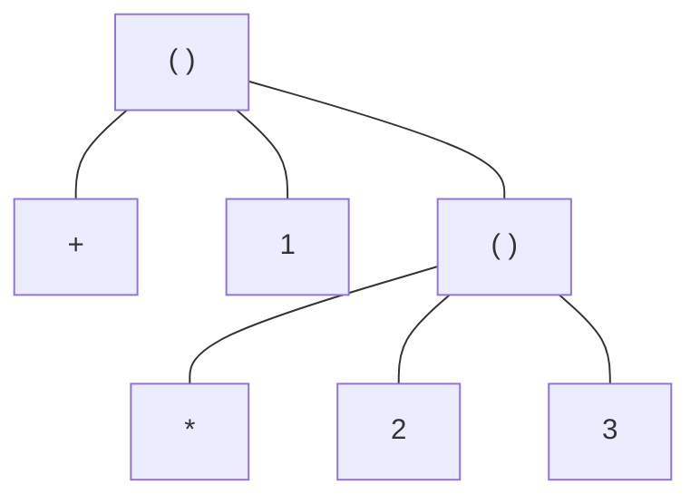
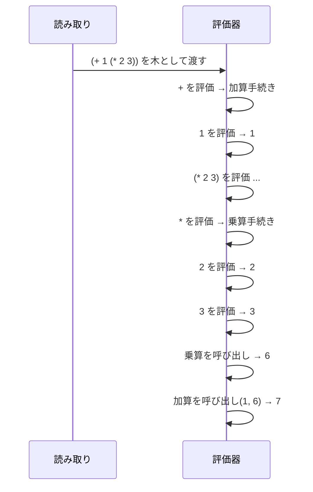
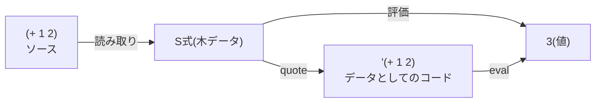

# 第 4 章 S式と評価モデル

この章は本書の **背骨** です。ここでつまずくと後が辛く、逆にここが腑に落ちれば残りは応用にすぎません。
「S式」と「評価」という 2 つの概念を、他言語との対比を交えて解剖します。

## 4.1 すべては「式」である

Python や Java には「文(statement)」と「式(expression)」の区別があります。`if` 文は文、`1 + 2` は式、`return` は文、のように。

Lisp/Racket では **ほとんどすべてが式** です。`if` も `define` も値を返します(あるいは副作用を起こしますが、それ自身「値を返す式」として扱われる)。

```text
> (if #t "yes" "no")
"yes"
> (define x (if (> 10 5) 100 200))
> x
100
```

この「ほぼ全部式」の世界だからこそ、Lisp は **式を式で包む** ことで処理を組み立てます。

## 4.2 S式 — 木としてのソースコード

**S式(S-expression)** は Lisp のソースコードの表現形式です。ルールは驚くほど単純です。

1. **アトム**(数値、文字列、シンボル、真偽値など)そのものは S式
2. **括弧** `( ... )` で囲まれ、中に S式が並んでいるものも S式

以上。これだけで言語全体の構文が決まっています。

具体例:

| S式 | 意味 |
| --- | --- |
| `42` | アトム(数値) |
| `"hello"` | アトム(文字列) |
| `x` | アトム(シンボル) |
| `(+ 1 2)` | 3つの S式を括弧で並べたもの |
| `(+ 1 (* 2 3))` | 括弧は入れ子にできる |

つまり Racket のソースコードは **構文木** そのものを書いていることになります。他言語だと「ソースコードをパースして構文木を作る」ステップがありますが、Racket では書いた瞬間にほぼ木ができています。



上の木は `(+ 1 (* 2 3))` を表しています。Racket ソースは **この木の深さ優先読み下し** にすぎません。

## 4.3 評価の基本規則

Racket が式を評価するときの規則はシンプルです。

1. **アトム** の評価
   - 数値・文字列・真偽値は **そのままの値** になる
   - シンボルは **束縛を探して値に置き換える**
2. **複合式 `(f a b c ...)`** の評価
   - **先頭 `f` が特殊フォームでなければ** →
     1. `f`, `a`, `b`, `c`, ... を左から順に評価する
     2. `f` の評価結果が関数なら、`(a の値)(b の値)(c の値)...` で呼び出す
   - **特殊フォーム(`if`, `define`, `lambda`, `quote`, ...)の場合** →
     - そのフォーム専用の規則で評価する

言葉だと硬いので、例で追います。

```text
> (+ 1 (* 2 3))
7
```



評価の順は **左から右・内側から外側** です。これは他言語の「演算子の結合法則」や「引数の評価順」と本質的に同じですが、Lisp では **全部が同じ規則** で動きます。中置演算子も関数呼び出しも特殊扱いではありません。

```text
> (+ 1 2 3)
6
> (+ 1 (* 2 3) 4)
11
```

`+` は **可変長引数**を取れます(他言語の演算子とはここが大きく違う)。「2個しか足せない」制約がないので、`(apply + '(1 2 3 4))` のような組み合わせが非常にきれいに書けます。

## 4.4 「特殊フォーム」は評価規則が違う

`if` は見た目が `(if 条件 真の式 偽の式)` という関数呼び出しっぽい形ですが、評価の規則が違います。

もし `if` が普通の関数だったら引数は **全部先に評価** されるので、`(if #t (print "A") (print "B"))` は A も B も両方出力してしまいます。それでは `if` の意味をなしません。

そこで `if` は **特殊フォーム** として扱われ、「条件を先に評価し、結果によって片方だけを評価する」という独自ルールを持っています。

代表的な特殊フォーム:

| フォーム | 役割 |
| --- | --- |
| `define` | 束縛を作る |
| `lambda` | 関数値を作る |
| `if` / `cond` / `when` / `unless` | 条件分岐 |
| `quote` / `'` | 評価を止める(後述) |
| `and` / `or` | 短絡評価 |
| `let` / `let*` / `letrec` | 局所束縛 |
| `set!` | 破壊的代入 |
| `begin` | 順に評価して最後の値を返す |

Racket で新しい特殊フォームを自分で作れるのが **マクロ**(第 16 章)です。

## 4.5 `quote` — 評価を止める魔法

評価規則によれば `(+ 1 2)` は 3 に評価されます。では **「`(+ 1 2)` という式そのもの」を値として扱いたい** ときはどうするか。`quote` を使います。

```text
> (+ 1 2)
3
> (quote (+ 1 2))
'(+ 1 2)
> '(+ 1 2)
'(+ 1 2)
```

`'式` は `(quote 式)` の略記です(シングルクォート)。`'(+ 1 2)` の結果は「`+`, `1`, `2` の 3 要素からなるリスト」という **データ** です。

この仕組みのおかげで Racket では **「コードはデータ」** という有名な性質が実現しています。コードもリストなので、リストを組み立てるのと同じ関数でコードを組み立てられます。

```text
> (eval (quote (+ 1 2)) (make-base-namespace))
3
```

`eval` はデータとしての式を **評価に戻す** 関数です。これは普段使う道具ではありませんが、「Lisp はコードとデータに壁がない」という感触を掴むには良い実験です。



## 4.6 シンボル — 名前そのものを値にする

`'hello` のように書くと、それは「`hello` というシンボル」という値になります。シンボルは他言語の「文字列」と混同しがちですが別物です。

```text
> (quote hello)
'hello
> 'hello
'hello
> (symbol? 'hello)
#t
> (string? 'hello)
#f
> (symbol->string 'hello)
"hello"
```

シンボルはよく次のような用途で使われます。

- 列挙値の代わり(`'red`, `'green`, `'blue`)
- ハッシュのキー
- マクロやコード生成の中で「変数名」を表現する

文字列と違い、**同じ綴りのシンボルは同じオブジェクト** です(`eq?` で比較できる)。この軽さが Lisp 的なデータ処理で効いてきます。

## 4.7 準クォート — 部分的に評価する

マクロや DSL を書くと「一部だけ評価して残りはデータとして残したい」場面が多発します。`quasiquote`(`` ` ``)と `unquote`(`,`)を使います。

```text
> `(1 ,(+ 1 1) 3)
'(1 2 3)
> `(1 ,@(list 2 3) 4)
'(1 2 3 4)
```

- `` ` `` で始まるリストは基本的にクォートされる
- `,` の直後の式だけは評価され、結果が差し込まれる
- `,@` は評価結果を **展開して** 埋め込む(スプライス)

これは JavaScript の `` `${...}` `` テンプレート文字列のリスト版だと思うと掴みやすいです。

## 4.8 リストとリテラルの表示

REPL で `(list 1 2 3)` と書いてもシングルクォート付きで表示されます。

```text
> (list 1 2 3)
'(1 2 3)
> (list (+ 1 1) (+ 2 2))
'(2 4)
```

これは「`print` がリストを `'(1 2 3)` という **`read` で読み戻せる形** で表示している」ためです。コード中に `'(1 2 3)` と書いたのと等価なリストが返っているわけで、**これを読み取り直せば同じリストを再構成できます**。

```text
> (read (open-input-string "(1 2 3)"))
'(1 2 3)
```

こういう「書いたままの形で値が返る」性質を **ホモイコニシティ(homoiconicity / 同像性)** と呼びます。Lisp 族の最大の特徴です。

## 4.9 他言語との翻訳表

他言語経験者のために、よくある翻訳を載せておきます。

| Python / JS | Racket |
| --- | --- |
| `1 + 2 * 3` | `(+ 1 (* 2 3))` |
| `f(x, y)` | `(f x y)` |
| `a && b` | `(and a b)` |
| `a ? b : c` | `(if a b c)` |
| `x = 10` | `(define x 10)` |
| `lambda: x + 1`(JS: `x => x + 1`) | `(lambda (x) (+ x 1))` |
| `[1, 2, 3]` | `'(1 2 3)` または `(list 1 2 3)` |
| `{'a': 1}` | `(hash 'a 1)` |
| `"hello" + name` | `(string-append "hello" name)` |

「記法が違うだけで、やっていることは同じ」 **と思っていれば最初は十分です**。先進的な違い(マクロ、継続、契約)はしばらく先で扱います。

## 4.10 本章のまとめ

- Racket のソースは S式 = 木構造の直書き
- 評価規則は「内側から外側、左から右」
- 特殊フォーム(`if`, `define`, `quote`, …)だけは独自の評価規則
- `quote` でコードをデータとして扱える
- `quasiquote` で部分的に値を差し込める
- 「コード = データ」という性質が Lisp の独自性の源

---

## 手を動かしてみよう

1. 次の式を 1 行ずつ REPL に投入し、**出力を予想してから** 打ち込んでください。

   ```racket
   (+ 1 2 3)
   (* (+ 1 2) (- 10 5))
   (if (> 3 5) 'big 'small)
   (quote (if (> 3 5) 'big 'small))
   `(1 ,(+ 1 1) ,@(list 3 4) 5)
   ```

   全部予想通りだったら第 5 章に進んで大丈夫です。

2. 次のコードを評価するとエラーが出ます。理由を **自分の言葉で** 説明してみてください。

   ```racket
   (1 2 3)
   ```

   期待される回答: 評価規則により `(1 2 3)` は「関数 `1` に `2` と `3` を渡す式」として扱われ、`1` は関数ではないのでエラー。

3. `symbol->string` と `string->symbol` を使って、`'hello` と `"hello"` を相互に変換してみてください。`eq?` と `equal?` で 2 つのシンボルを比較してみると、どんな違いが観察できますか?

   ```text
   > (eq? (string->symbol "hi") 'hi)
   #t
   > (equal? (string->symbol "hi") 'hi)
   #t
   ```

   …のように、どのシンボルも等価になる様子を確認してください。
