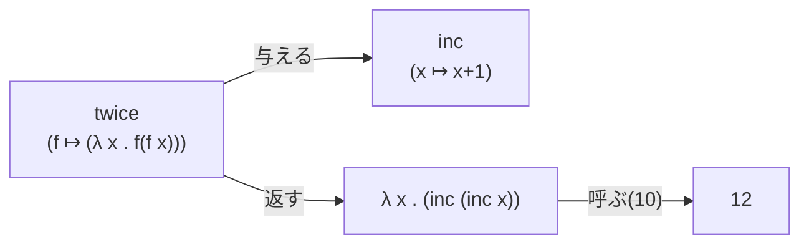
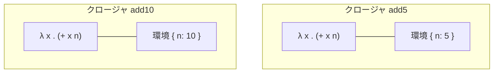

# 第 5 章 関数を値として扱う

Lisp 系言語は「関数型言語のファミリー」に分類されます。その中核は **「関数がデータとして他の値と対等に扱える」** という一点です。この章でその意味を、道具を増やしながら染み込ませていきます。

## 5.1 `define` で関数を定義する

Racket には関数定義の略記法と、フル形があります。

```racket
;; 略記法
(define (square x) (* x x))

;; フル形(意味的にまったく同じ)
(define square (lambda (x) (* x x)))
```

```text
> (define (square x) (* x x))
> (square 7)
49
```

「略記法は糖衣構文で、本質は `(define 名前 式)` である」 ことを覚えておくと、後の高階関数の節ですっと理解できます。

### 複数引数・可変長引数・オプション引数

```racket
(define (hypot a b) (sqrt (+ (* a a) (* b b))))        ; 2引数
(define (sum . xs) (apply + xs))                        ; 可変長
(define (greet name [lang "ja"])                        ; オプション引数
  (cond [(equal? lang "ja") (string-append "こんにちは " name)]
        [(equal? lang "en") (string-append "hello "     name)]))
```

REPL:

```text
> (hypot 3 4)
5
> (sum 1 2 3 4 5)
15
> (greet "レキ")
"こんにちは レキ"
> (greet "Reki" "en")
"hello Reki"
```

### キーワード引数

```racket
(define (greet2 name #:lang [lang "ja"])
  (if (equal? lang "ja")
      (string-append "こんにちは、" name)
      (string-append "hello, " name)))
```

```text
> (greet2 "レキ")
"こんにちは、レキ"
> (greet2 "Reki" #:lang "en")
"hello, Reki"
```

`#:name` で始まるのがキーワード引数です。Python の `name=value` に相当しますが、**呼び出し側でも `#:name` を明示** します。順序に依存しないので、多くの引数がある関数の可読性が大きく上がります。

## 5.2 `lambda` と関数リテラル

無名関数は `lambda` または短縮形 `λ` で書けます(`λ` は `Ctrl+\` で入力できます。DrRacket が変換してくれます)。

```racket
((lambda (x) (+ x 1)) 10)      ; => 11
((λ (x) (+ x 1)) 10)           ; => 11
```

これは「関数リテラルを即時呼び出し(IIFE)」している例です。JavaScript の `((x) => x + 1)(10)` と同じ感覚です。

### 関数を値として渡す

関数は **ただの値** なので、変数に代入したり、他の関数に渡したりできます。

```text
> (define add +)
> (add 3 4 5)
12
```

`+` という関数を `add` という名前でも呼べるようにしただけです。他の言語では「演算子」が特別扱いされて関数として渡せなかったり、`operator.add` のように特別なインポートが要ったりしますが、Racket では **初めから対等** です。

## 5.3 関数を返す関数・受け取る関数

**高階関数(higher-order function)** と呼びます。**「関数を受ける」か「関数を返す」か、両方か** のどれかを満たすものです。

### 関数を受け取る

`map` はその典型です。

```text
> (map (lambda (x) (* x x)) '(1 2 3 4))
'(1 4 9 16)
```

### 関数を返す

```racket
(define (twice f)
  (lambda (x) (f (f x))))

(define inc (lambda (x) (+ x 1)))
```

```text
> ((twice inc) 10)
12
```

`twice` は「関数 `f` を受け取って、`(f (f x))` を計算する **新しい関数** を返す」働きをします。`inc` を渡すと「2 回インクリメント」する関数が得られるわけです。



### 関数合成

2 つの関数を「合成」するのも簡単です。

```racket
(define (compose f g) (lambda (x) (f (g x))))
```

```text
> ((compose inc square) 3)
10
```

`(square 3)` で 9、その結果に `inc` で 10。Racket には標準で `compose` が用意されていますが、自分で書けるようになると「ああ、関数って本当にただの値なんだな」が実感できます。

## 5.4 クロージャ — 関数は環境を覚える

関数は **定義されたときの環境** を一緒に連れて歩きます。これを **クロージャ** と呼びます。

```racket
(define (make-adder n)
  (lambda (x) (+ x n)))

(define add5 (make-adder 5))
(define add10 (make-adder 10))
```

```text
> (add5 3)
8
> (add10 3)
13
```

`make-adder` が返す関数は **`n` の値を覚えている**。別々に作った `add5` と `add10` は独立したクロージャで、それぞれ `n = 5` と `n = 10` を抱えています。



### 状態を隠すカウンター

クロージャは「データと振る舞いを束ねる」ので、他言語のオブジェクトに近いものも作れます。

```racket
(define (make-counter)
  (define n 0)
  (lambda ()
    (set! n (+ n 1))
    n))

(define c (make-counter))
```

```text
> (c)
1
> (c)
2
> (c)
3
```

ここで `n` は `make-counter` の内部にいるので外からは見えません。これは **カプセル化** そのものです。JavaScript のクロージャパターン(`const counter = (() => { let n = 0; return () => ++n; })()`)と発想は同じです。

## 5.5 局所束縛 `let` / `let*` / `letrec`

一時的な名前を作りたいときは `let` 系を使います。

```text
> (let ([a 1] [b 2]) (+ a b))
3
```

`let` は **平行束縛**。右辺を **同時に** 評価してから一斉に束縛します。だから `b` の初期化式で `a` は(もし外にあれば)外側のものを見ます。

```text
> (let* ([a 1] [b (+ a 1)]) (+ a b))
3
```

`let*` は **順次束縛**。上から順に評価し、`b` の初期化式で `a` を参照できます。

```racket
(letrec ([even? (lambda (n) (if (zero? n) #t (odd?  (- n 1))))]
         [odd?  (lambda (n) (if (zero? n) #f (even? (- n 1))))])
  (even? 10))
;; => #t
```

`letrec` は **相互再帰** を許す束縛。`even?` の定義中で `odd?` に、`odd?` の定義中で `even?` に触れます。

> `let` は `((lambda (...) ...) ...)` の糖衣構文とみなせます。覚え方としては「`let` を見たら、中身をラムダに開いて考える」ととても楽になります。

## 5.6 `cond` — 多方向の条件分岐

他言語の `if / else if / else` に相当するのが `cond` です。

```racket
(define (sign x)
  (cond [(positive? x) 'positive]
        [(negative? x) 'negative]
        [else 'zero]))
```

```text
> (sign 3)
'positive
> (sign -1)
'negative
> (sign 0)
'zero
```

**`cond` は本書で最も多用する条件分岐** です。`if` を入れ子にするより圧倒的に読みやすいので、条件が 3 つ以上あったら迷わず `cond` を使ってください。

### `when` / `unless`

`when` は「条件が真なら本体を評価して最後の値を返す。偽なら `(void)`」というフォーム。`unless` は逆。

```racket
(define (warn-negative x)
  (when (negative? x)
    (displayln "⚠ x が負の値です!")))
```

```text
> (warn-negative -3)
⚠ x が負の値です!
> (warn-negative 5)          ; 何も表示されない
```

## 5.7 純粋関数を目指す

クロージャで状態を隠せるのは強力ですが、**できるだけ `set!` を使わず副作用を避けた書き方** を Racket では推奨します。副作用のない関数は:

- テストしやすい
- 並行処理に強い
- 推論・最適化が効きやすい

という利点があります。本書でも特別な理由がない限り純粋な書き方で進めます。

## 5.8 本章のまとめ

- `define` の関数定義は `lambda` の糖衣構文
- 関数は値であり、変数に入れられ、引数に渡せ、返り値として返せる
- クロージャ = 関数 + 定義時環境
- `let` / `let*` / `letrec` で局所束縛
- `cond` / `when` / `unless` で可読な条件分岐
- 副作用を避けた書き方が Racket の文化

---

## 手を動かしてみよう

1. 次の関数 `pow` は繰り返し二乗法で累乗を計算します。まず何を返すか予想し、REPL で答え合わせしましょう。
   ```racket
   (define (pow b n)
     (cond [(= n 0) 1]
           [(even? n) (pow (* b b) (/ n 2))]
           [else (* b (pow b (- n 1)))]))
   ```

   ```text
   > (pow 2 10)
   1024
   > (pow 3 5)
   243
   ```

2. `compose` を使って、「引数を 3 乗して 1 加える関数」を 1 行で書いてください。ヒント:
   ```racket
   ((compose (lambda (x) (+ x 1)) (lambda (x) (* x x x))) 2)
   ;; => 9
   ```

3. 次のような「カウンター」を作ってみましょう。`(c)` で現在値を返し、`(c 'reset)` で 0 に戻るようにします。
   ```racket
   (define (make-counter-ex)
     (define n 0)
     (lambda args
       (cond
         [(null? args)
          (set! n (+ n 1))
          n]
         [(equal? (car args) 'reset)
          (set! n 0)
          'reset-done])))
   ```
   ```text
   > (define c (make-counter-ex))
   > (c)
   1
   > (c)
   2
   > (c 'reset)
   'reset-done
   > (c)
   1
   ```
   `args` には呼び出し時の引数列がリストとして入ります(可変長引数の記法)。

次章では、これら道具を使って **再帰** を徹底的に練習します。
