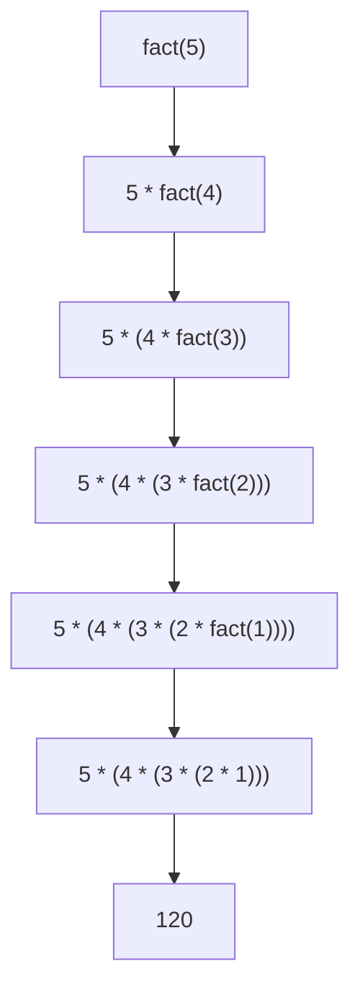
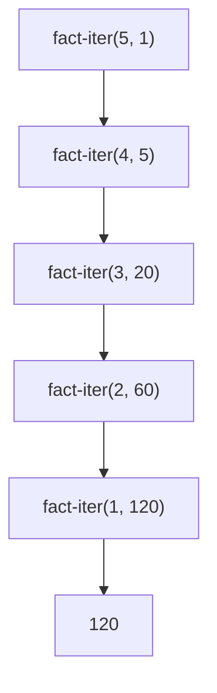
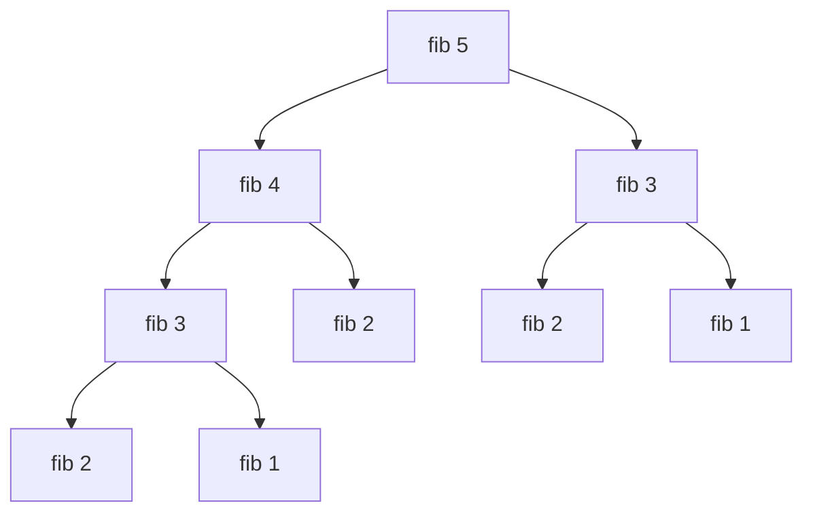

# 第 6 章 再帰で考える

Lisp にはもちろん `for` や `while` がありますが、**まずは無しでやってみる** のが Racket らしい入門です。ループは再帰の特殊形にすぎない、という見方を体に染み込ませます。

## 6.1 素朴な再帰 — 階乗

階乗 `n! = n * (n-1) * ... * 1` は再帰で書くのが自然です。

```racket
(define (fact n)
  (if (<= n 1)
      1
      (* n (fact (- n 1)))))
```

```text
> (fact 5)
120
> (fact 10)
3628800
```

**再帰関数を書くときの構え** は常に 2 ステップです。

1. **ベースケース**: 「これ以上分解できない最小の入力」 をどう返すか決める
2. **再帰ステップ**: 「自分より小さな問題の答え」を自分自身に解かせ、それを使って今の答えを組み立てる

階乗なら:

- ベース: `n ≤ 1` のとき `1`
- 再帰: `n * fact(n-1)`

評価の展開はこう読めます。



展開の木が **深く** 伸びていきます。`n * ...` の乗算は「再帰から帰ってきたとき」に初めて行われるので、 **スタックにどんどん積まれる** のが特徴です。

## 6.2 累算引数 — 末尾再帰への書き換え

Racket は **末尾呼び出し最適化(TCO)** を言語仕様として保証しています。「関数の最後の仕事が関数呼び出しそのものである」 場合、新しいスタックフレームを積まずに飛び込んでくれる。つまり **どれだけ深い再帰でもスタックが溢れない**。

`fact` を累算引数(accumulator)付きに書き換えます。

```racket
(define (fact-iter n acc)
  (if (<= n 1)
      acc
      (fact-iter (- n 1) (* n acc))))
```

```text
> (fact-iter 10 1)
3628800
```

違いはわずかですが重要です。

- **前の `fact`**: 再帰の「後で」 `*` をする → スタックに積む必要あり
- **`fact-iter`**: 再帰の「前で」 `*` を済ませ、計算結果を引数に積む → 末尾呼び出し

展開の木はこうなります。



木が「深く積み上がる」のではなく、**横にスライドしていく** 感覚です。これが末尾再帰の絵です。

> **覚え方**: 再帰呼び出しが `(* n (f ...))` のように **外側に計算が残る** なら末尾ではない。`(f ...)` のように **そのまま返す** 形なら末尾。

### 公開 API を変えずに末尾にしたい

呼び出し側に `(fact-iter 10 1)` のような余計な `1` を見せたくないときは、内部関数を使います。

```racket
(define (fact n)
  (define (loop n acc)
    (if (<= n 1) acc (loop (- n 1) (* n acc))))
  (loop n 1))
```

これは Racket で **最も頻出するイディオム** の 1 つです。`loop` や `go` という内部関数名をよく使います。

## 6.3 木再帰 — フィボナッチ

次の素朴なフィボナッチは 2 つの再帰呼び出しが現れるので、計算量が指数的です。

```racket
(define (fib n)
  (if (< n 2)
      n
      (+ (fib (- n 1)) (fib (- n 2)))))
```

```text
> (fib 10)
55
> (fib 20)
6765
```

`fib 30` くらいになるとはっきり遅くなり、`fib 50` は現実的な時間で終わりません。

展開の木を描くとこの通り:



同じ部分木を何度も計算していることが一目瞭然です。

### 末尾再帰版

2 変数を運べば、フィボナッチも末尾再帰にできます。

```racket
(define (fib-iter n)
  (define (loop i a b)
    (if (= i n) a (loop (+ i 1) b (+ a b))))
  (loop 0 0 1))
```

```text
> (fib-iter 10)
55
> (fib-iter 50)
12586269025
```

`fib-iter 100000` でも数秒で返ります。これが **末尾再帰の威力** です。

## 6.4 `let` によるループ風記法 — 名前付き `let`

Racket には `let` に名前を付ける書き方があり、**その場で再帰関数を定義して即呼び出し** できます。ループを書きたい気分のときに多用します。

```racket
(define (fib-iter2 n)
  (let loop ([i 0] [a 0] [b 1])
    (if (= i n) a (loop (+ i 1) b (+ a b)))))
```

意味は先の `fib-iter` と同じですが、**ループ変数の初期値と更新がひと塊に** なっていて読みやすい。

次の公式と等価です:

```racket
(define (fib-iter2 n)
  (define (loop i a b)
    (if (= i n) a (loop (+ i 1) b (+ a b))))
  (loop 0 0 1))
```

名前付き `let` は Scheme 時代からの慣用句で、Racket でも最頻出のパターンです。

## 6.5 相互再帰

2 つ以上の関数が互いに呼び合う形。Racket なら特別な準備なしに書けます(モジュールトップレベルの `define` は前方参照可能)。

```racket
(define (even? n) (if (= n 0) #t (odd?  (- n 1))))
(define (odd?  n) (if (= n 0) #f (even? (- n 1))))
```

`letrec` を使えば局所的にも同じことができます(第 5 章参照)。

## 6.6 リスト処理での再帰

リストは再帰と最高に相性がいい構造です。**`null?` を見る・`cdr` で 1 段縮める** が合言葉。

```racket
(define (length-my xs)
  (if (null? xs) 0 (+ 1 (length-my (cdr xs)))))

(define (sum-list xs)
  (if (null? xs) 0 (+ (car xs) (sum-list (cdr xs)))))
```

```text
> (length-my '(a b c d))
4
> (sum-list '(1 2 3 4 5))
15
```

この 2 つは `foldr` や `foldl` の一例でもあります(第 8 章で再訪)。

## 6.7 停止条件を外す — 発散する再帰

停止条件が間違っていると、末尾再帰でも **無限ループ** になります。

```racket
;; 誤り: n が 0 になっても終わらない
(define (bad n)
  (bad (- n 1)))
```

Racket は末尾再帰を最適化するので、これはメモリを消費せずに **永遠に走り続けます**。DrRacket の `Stop` ボタンか `Ctrl+.` で止めてください。

停止条件を必ず「減っていく量」「減らない量」の両方で確認する癖をつけましょう。

## 6.8 ケーススタディ:ハノイの塔

古典問題「ハノイの塔」を再帰で書いてみます。`n` 枚を棒 `from` から `to` へ、`via` を経由して動かす。

```racket
;; 手数を返す版
(define (hanoi n from to via)
  (cond
    [(= n 0) 0]
    [else
     (+ (hanoi (- n 1) from via to)
        1
        (hanoi (- n 1) via to from))]))
```

```text
> (hanoi 3 'A 'C 'B)
7
> (hanoi 10 'A 'C 'B)
1023
```

手順を出力する版も書けます。

```racket
(define (hanoi-trace n from to via)
  (cond
    [(= n 0) (void)]
    [else
     (hanoi-trace (- n 1) from via to)
     (printf "move ~a -> ~a~n" from to)
     (hanoi-trace (- n 1) via to from)]))
```

```text
> (hanoi-trace 3 'A 'C 'B)
move A -> C
move A -> B
move C -> B
move A -> C
move B -> A
move B -> C
move A -> C
```

「`n-1` 枚を避難させ、1 枚を動かし、再び `n-1` 枚を目的地に乗せる」という 3 段のロジックがそのままコードに写っています。**アルゴリズムの擬似コードをそのまま Racket に落とし込めるのが再帰の気持ちよさ** です。

## 6.9 本章のまとめ

- 再帰は「ベースケース + 小さな問題への委譲」の 2 ステップで書く
- 末尾呼び出しになるよう累算引数を持つと、どれだけ深くても安全
- 名前付き `let` はループ感覚で書ける便利な構文
- リスト処理は `null?` + `cdr` のパターンが定石
- 相互再帰・木再帰も自然に書けるが、計算量には注意

---

## 手を動かしてみよう

1. リストの要素を 1 つずつ 2 倍する `double-all` を再帰で書きなさい。`map` は **使わない** こと。
   ```racket
   (define (double-all xs)
     (if (null? xs)
         '()
         (cons (* 2 (car xs)) (double-all (cdr xs)))))
   ```
   ```text
   > (double-all '(1 2 3 4))
   '(2 4 6 8)
   ```

2. 上の関数は末尾再帰ではありません。理由を説明してください(ヒント: `cons` が再帰の外側に残っている)。末尾再帰化するには、累算引数にリストを逆順で積み、最後に `reverse` する方法が典型です。
   ```racket
   (define (double-all-iter xs)
     (let loop ([xs xs] [acc '()])
       (if (null? xs)
           (reverse acc)
           (loop (cdr xs) (cons (* 2 (car xs)) acc)))))
   ```

3. 次の再帰関数は何を計算しているでしょうか。REPL で値を見ながら推測してください。
   ```racket
   (define (mystery xs)
     (cond
       [(null? xs) 0]
       [(null? (cdr xs)) (car xs)]
       [else (mystery (cons (+ (car xs) (cadr xs)) (cddr xs)))]))
   ```
   ```text
   > (mystery '(1 2 3 4 5))
   15
   > (mystery '(10 20))
   30
   ```
   答え: リストの要素を順に足し込む再帰(ただし先頭 2 つを畳んでいく実装)。

次章では、この再帰的な目でリストというデータ構造そのものを詳しく見ていきます。
