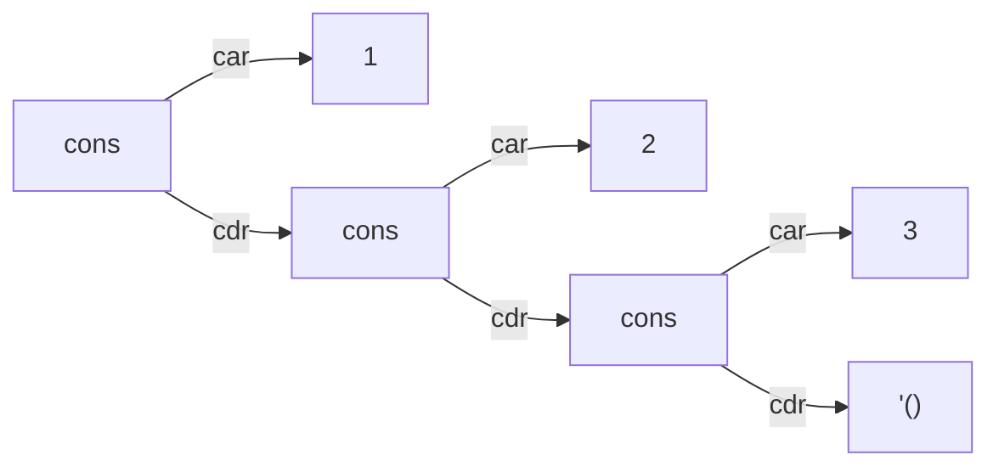
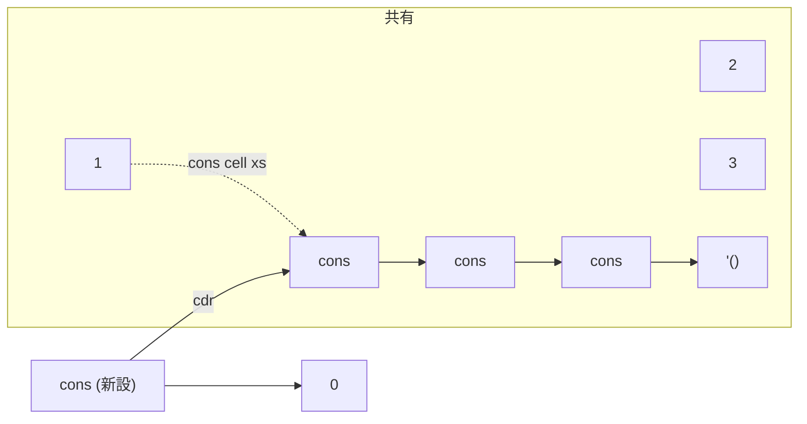

# 第 7 章 リストとコンスセル

Lisp という名前の由来は **LIS**t **P**rocessor です。名前の通り、リストという 1 つのデータ型を極限まで活用するよう設計されています。この章ではその内部構造から慣用句までを押さえます。

## 7.1 コンスセル — リストの正体

Racket のリストは、**コンスセル(cons cell)** と呼ばれる 2 要素のペアを数珠つなぎにしたものです。各コンスセルは

- 先頭の値を指すフィールド(**car**)
- 次のコンスセルを指すフィールド(**cdr**)

を持つ単方向リンクリストです。末尾は **空リスト** `'()` で終わります。



コードでこの構造を手で組み立てるとこうなります。

```text
> (cons 1 (cons 2 (cons 3 '())))
'(1 2 3)
> (list 1 2 3)
'(1 2 3)
```

`list` は `cons` の連鎖を作る糖衣関数です。内部表現は同じものになります。

### `car` と `cdr`

由来は 60 年前の IBM 704 のレジスタ名(`contents of address register` / `contents of decrement register`)で、今となってはほぼ儀式的な名前です。現代では `first` と `rest` という別名もあります。

```text
> (car '(a b c))
'a
> (cdr '(a b c))
'(b c)
> (first '(a b c))
'a
> (rest '(a b c))
'(b c)
```

先頭から 2 個目を取るときに `(car (cdr xs))` と書くのは面倒なので、**短縮記法** が用意されています。

```text
> (cadr '(a b c))
'b
> (caddr '(a b c))
'c
```

`c a d r` は「cdr してから car」の意味。`c a d d r` は「cdr してさらに cdr して car」。大文字で読むと c-a-d-r の **各文字を右から左に実行** するイメージです。4 段までは標準で組み込まれています(`caddr`, `cadddr` は存在、`caddddr` はない)。

> 最初は戸惑いますが、2〜3 文字までなら覚える価値があります。4 文字以上は `list-ref` を使った方が読みやすいです。

## 7.2 ドット対 — リストでないコンスセル

`cons` の第 2 引数が空リストか別のコンスセルなら「リスト」と呼べますが、**それ以外の値** を入れてもエラーになりません。結果は **ドット対** と呼ばれ、点付きの特殊な表示になります。

```text
> (cons 1 2)
'(1 . 2)
> (cons 1 (cons 2 3))
'(1 2 . 3)
> (list? (cons 1 2))
#f
> (pair? (cons 1 2))
#t
```

- `list?` は「末尾が空リストまで続くか」を判定する
- `pair?` は「cons セル 1 つ分でも」真

通常の Lisp プログラミングではドット対はあまり積極的に使いません。「リストとして成立しないコンスセル」が `pair? #t` かつ `list? #f` になる、という区別を覚えておけば十分です。

## 7.3 基本の操作

主要な手続きを一通り触っておきます。

```text
> (cons 'x '(a b c))
'(x a b c)
> (append '(1 2 3) '(4 5 6))
'(1 2 3 4 5 6)
> (reverse '(1 2 3))
'(3 2 1)
> (length '(a b c d))
4
> (list-ref '(a b c d) 2)
'c
> (null? '())
#t
> (null? '(1))
#f
> (member 3 '(1 2 3 4))
'(3 4)
> (assoc 'b '((a 1) (b 2) (c 3)))
'(b 2)
```

|関数|意味|計算量|
|---|---|---|
|`cons`|先頭に要素を追加したリストを返す|O(1)|
|`car` / `cdr`|先頭 / 残りを取り出す|O(1)|
|`append`|2 つのリストを連結|O(n)(第 1 引数の長さ)|
|`reverse`|順序を反転した新しいリスト|O(n)|
|`length`|長さ|O(n)|
|`list-ref`|n 番目の要素|O(n)|
|`member`|値を探し、見つかった位置以降のリストを返す|O(n)|
|`assoc`|連想リストから key 一致の組を返す|O(n)|

`cons` が O(1) で、リストは **先頭追加に強い** というのがポイントです。配列と違い、**末尾追加は遅い**(全体をコピーすることになる)ので、頭にどんどん積んで最後に `reverse` するのが定石です。

## 7.4 不変 vs 可変 — Racket の基本は不変

Racket のペア / リストは **不変(immutable)** です。一度作ると中身を書き換えられません。

```text
> (define xs '(1 2 3))
> (cons 0 xs)
'(0 1 2 3)
> xs
'(1 2 3)
```

`(cons 0 xs)` は **新しいコンスセルを 1 つ作り**、その `cdr` が `xs` を指すようにします。`xs` 自体は変わっていない点に注意。



「先頭だけ拡張された新しいリスト」が、古いリストの中間・末尾と **コンスセルを共有** しているのがわかります。不変だからこそこの共有が安全で、大量のリストを扱っても実は効率的です。

### どうしても破壊的に書きたいとき

`mcons` / `mcar` / `mcdr` / `set-mcar!` / `set-mcdr!` という mutable pair があります。また、既存の不変リストを破壊的に書き換える API はありません(これはわざとです)。

```text
> (define mp (mcons 1 (mcons 2 (mcons 3 '()))))
> (set-mcar! mp 99)
> mp
(mcons 99 (mcons 2 (mcons 3 '())))
```

本書ではほぼ使いません。**不変リスト + 新規生成** の発想が Racket の基本です。

## 7.5 再帰とリストのパターン

第 6 章で見た通り、リストと再帰は最高の組み合わせです。典型的な 3 パターンを再掲します。

### パターン 1: リスト全体を走査して 1 つの値を作る(畳み込み)

```racket
(define (sum-list xs)
  (if (null? xs)
      0
      (+ (car xs) (sum-list (cdr xs)))))
```

### パターン 2: リストから新しいリストを作る(写像)

```racket
(define (increment-all xs)
  (if (null? xs)
      '()
      (cons (+ 1 (car xs)) (increment-all (cdr xs)))))
```

### パターン 3: 条件に合う要素だけ残す(絞り込み)

```racket
(define (only-positive xs)
  (cond
    [(null? xs) '()]
    [(positive? (car xs)) (cons (car xs) (only-positive (cdr xs)))]
    [else (only-positive (cdr xs))]))
```

```text
> (sum-list '(1 2 3 4 5))
15
> (increment-all '(1 2 3))
'(2 3 4)
> (only-positive '(1 -2 3 -4 5))
'(1 3 5)
```

この 3 パターンは **それぞれ `foldr` / `map` / `filter` で書ける** 定石です。第 8 章でまとめて扱います。

## 7.6 連想リスト(alist)

古典的な Key-Value データ構造です。リストの中に「`(key 値)` のペア」を並べただけ。

```racket
(define persons
  '((reki 17 "エンジニア")
    (yui  22 "デザイナー")
    (ken  30 "マネージャ")))

(assoc 'yui persons)     ; => '(yui 22 "デザイナー")
(cadr (assoc 'yui persons)) ; => 22
```

O(n) の線形検索ですが、**リテラルで書けて読みやすい** ので設定値や小さなテーブルでは非常に便利です。本格的な Key-Value は第 9 章のハッシュで扱います。

## 7.7 リスト内包に近い `for/list`

Python の `[x*x for x in xs if x % 2 == 1]` 相当は、Racket では `for/list` で書けます。

```text
> (for/list ([x (in-list '(1 2 3 4 5))]
             #:when (odd? x))
    (* x x))
'(1 9 25)
```

これは実は **ループ形のマクロ** で、裏で再帰展開されます。ループ構文を直接使ってもいいですし、再帰で書いてもいい。**道具を状況で使い分ける** 文化が Racket にはあります。

## 7.8 本章のまとめ

- リストはコンスセルの鎖、末尾は `'()`
- `car` / `cdr` が 2 つの基本操作、`cadr` などは合成
- リストはデフォルト不変で、共有されるため効率的
- 典型は「ベース + cons / append」の再帰 3 パターン
- 連想リストと `for/list` も手札に

---

## 手を動かしてみよう

1. `my-last` — リストの末尾要素を返す関数を再帰で書きなさい。
   ```racket
   (define (my-last xs)
     (cond
       [(null? xs) (error "empty list")]
       [(null? (cdr xs)) (car xs)]
       [else (my-last (cdr xs))]))
   ```
   ```text
   > (my-last '(a b c d))
   'd
   ```

2. `my-reverse` — `reverse` を自分で実装しなさい。末尾再帰版が書けたら合格。
   ```racket
   (define (my-reverse xs)
     (let loop ([xs xs] [acc '()])
       (if (null? xs) acc (loop (cdr xs) (cons (car xs) acc)))))
   ```

3. `flatten1` — 1 段だけネストしたリストを平らにする関数を、`append` と再帰だけで書きなさい。
   ```racket
   (define (flatten1 xss)
     (if (null? xss)
         '()
         (append (car xss) (flatten1 (cdr xss)))))
   ```
   ```text
   > (flatten1 '((1 2) (3) (4 5 6)))
   '(1 2 3 4 5 6)
   ```
   完全なネストに対応する `flatten` は標準で用意されています。

次章はこれらのパターンを **まとめて扱う高階関数** を身につけます。
