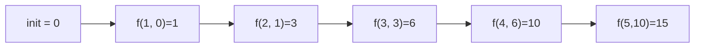

# 第 8 章 高階関数とデータ変換

第 7 章で見た「再帰でリストを処理するパターン」を、**関数を関数で扱う** という視点で整理し直します。ここを押さえると、Racket で書くコード量が目に見えて減ります。

## 8.1 `map` — 各要素を変換

各要素に同じ関数を適用して新しいリストを作る。

```text
> (map (lambda (x) (* x x)) '(1 2 3 4 5))
'(1 4 9 16 25)
```

第 7 章で書いた `increment-all` は `(map add1 xs)` の 1 行で済んでしまいます。

### 複数リストをまとめて扱う

Racket の `map` は任意個のリストを取れます。関数は同じ個数の引数を受けるよう書きます。

```text
> (map + '(1 2 3) '(10 20 30))
'(11 22 33)
```

Python の `zip` + `map` に相当する操作が組み込みです。

## 8.2 `filter` — 条件に合う要素だけ

```text
> (filter odd? '(1 2 3 4 5 6))
'(1 3 5)
```

`odd?` は述語(真偽値を返す関数)。条件を関数として渡せるので、 `filter` 本体は 1 つのままでいくらでも再利用できます。

## 8.3 `foldl` / `foldr` — 畳み込み

リスト全体を走査して 1 つの値に集約する操作は、**畳み込み** と呼ばれます。`foldl` と `foldr` の違いは **結合方向** です。

```text
> (foldl + 0 '(1 2 3 4 5))
15
```

`(foldl f 初期値 '(a b c d))` は概念的にこう動きます。

```text
init → a → b → c → d
```

各ステップで `(f 要素 これまでの累算)` を計算します。左から右へ処理しますが、**他の言語の reduce と違い引数の順が逆** なので注意してください。



一方 `foldr` は「右から処理し、最後に全部を組み合わせる」イメージ。次の例で違いが出ます。

```text
> (foldr cons '() '(1 2 3))
'(1 2 3)
> (foldl cons '() '(1 2 3))
'(3 2 1)
```

- `foldr` で `cons` を使うと **リストをそのまま再構築**(恒等写像のように見える)
- `foldl` で `cons` を使うと **順序が反転**

使い分けの指針:

- 「順序を保ったまま作り直したい」 → `foldr`(ただし非末尾再帰なので大きなリストでスタックに注意…と言いたいところだが Racket の `foldr` はちゃんと末尾最適化されているので普段は気にしなくて良い)
- 「累算して答えを得たい」 → `foldl`

### 関数型三種の神器

以下の 3 関数は関数型プログラミングの基本セットで、**本章以降の章でも頻繁に出てきます**。

| 関数 | 働き |
| --- | --- |
| `map` | 各要素を変換する |
| `filter` | 条件で要素を絞り込む |
| `foldl` / `foldr` | 累積して 1 つの値を作る |

「`for` ループを書きたくなったら、まずこの 3 つで書けないか考える」 のが関数型スタイルです。

## 8.4 `apply` — 引数リストを展開して渡す

関数に渡す引数が **すでにリストの形** で手元にあることがあります。そのときは `apply` を使います。

```text
> (apply + '(1 2 3 4))
10
> (apply max '(3 7 2 9 4))
9
```

Python の `f(*xs)` や JavaScript の `f(...xs)` に相当します。

## 8.5 `partition` — 真偽で 2 つに分ける

`filter` で真の要素、もう一度 `filter` で偽の要素、と書けますが、1 回で済みます。

```text
> (define-values (evens odds) (partition even? '(1 2 3 4 5 6)))
> evens
'(2 4 6)
> odds
'(1 3 5)
```

Racket の関数は **多値を返せます**。`define-values` で受け取ります。

## 8.6 `sort`

標準のソートも高階関数として用意されています。

```text
> (sort '(3 1 4 1 5 9 2 6) <)
'(1 1 2 3 4 5 6 9)
> (sort '("pear" "apple" "banana") string<?)
'("apple" "banana" "pear")
```

比較関数を渡す形なので、多態に動きます。Python の `sorted(xs, key=...)` に相当する `#:key` キーワードもあります。

```text
> (sort '("pear" "apple" "banana") < #:key string-length)
'("pear" "apple" "banana")
```

ここで比較関数 `<` を数値用にしていることに注意。`#:key` が各要素を `string-length` に通すので、**比較対象は整数** になります。

## 8.7 関数合成とカリー化

### 関数合成 `compose`

標準の `compose` は **任意個** の関数を合成します。右の関数から順に適用されます。

```racket
(define fourth-power (compose square square))
```

```text
> (fourth-power 3)
81
```

### カリー化

多引数関数を「1 引数関数を返す関数」に変換します。自作してみましょう。

```racket
(define (curry2 f)
  (lambda (x) (lambda (y) (f x y))))
```

```text
> (((curry2 +) 10) 5)
15
> (define add3 ((curry2 +) 3))
> (add3 100)
103
```

標準でも `curry` / `curryr` が用意されています。

```text
> ((curry + 10) 5)
15
> ((curryr / 2) 10)
5
```

`curryr` は「最後の引数を後で受け取る」形(`curry right` の略)。

## 8.8 `for` 系 — Racket 流の高階ループ

関数型スタイルの `map`/`filter`/`fold` と並んで、Racket には **`for` フォーム** があります。

```text
> (for/sum ([x (in-range 1 11)]) x)
55
> (for/list ([x (in-range 5)]) (* x x))
'(0 1 4 9 16)
> (for/hash ([k '(a b c)] [v '(1 2 3)]) (values k v))
'#hash((a . 1) (b . 2) (c . 3))
```

- `for/sum` は本体の評価値を合計
- `for/list` はリストを収集
- `for/hash` はハッシュテーブルを作る

これらはマクロで、再帰なしに「どういう結果を集めたいか」から書ける便利な道具です。裏では末尾再帰に展開されているので速度もネイティブループ並みです。

### ジェネレータ

`in-list` / `in-range` / `in-vector` / `in-hash` などの「シーケンス」を渡せます。`#:when` や `#:unless` でフィルタもできるため、**リスト内包表記** のような使い方ができます。

```text
> (for*/list ([x (in-range 1 4)]
              [y (in-range 1 4)]
              #:when (not (= x y)))
    (list x y))
'((1 2) (1 3) (2 1) (2 3) (3 1) (3 2))
```

`for*` は多重ループ(ネスト)。`for` は「同時に進む」複数シーケンス、`for*` は「入れ子の」シーケンスです。

## 8.9 関数型 vs ループ形式の使い分け

| 状況 | 向いているスタイル |
| --- | --- |
| 要素ごとの単純変換 | `map` / `filter` |
| 集計 | `for/sum` / `for/fold` / `foldl` |
| 複数の中間コレクション | `for/list` + `#:when` |
| 複雑な条件分岐 | 再帰 + `cond` |
| 破壊的更新 | 本当に必要か見直す → 必要なら `for` + `set!` |

どれが正解ということはなく、**読みやすさ** を最優先に選びます。

## 8.10 本章のまとめ

- `map` / `filter` / `foldl`・`foldr` の 3 つが関数型データ処理の中核
- `apply` は引数リストを展開して渡す
- `compose` と `curry` で関数を組み合わせられる
- `for/list` / `for/sum` / `for/hash` は Racket 独自の便利マクロ
- 関数を値として扱える言語では、**ループもデータ変換もデータとして組み合わせ可能**

---

## 手を動かしてみよう

1. 自前の `my-map` を、`foldr` を使って 1 行で書きなさい。
   ```racket
   (define (my-map f xs)
     (foldr (lambda (x acc) (cons (f x) acc)) '() xs))
   ```

2. `my-filter` を `foldr` で書きなさい。
   ```racket
   (define (my-filter pred xs)
     (foldr (lambda (x acc) (if (pred x) (cons x acc) acc)) '() xs))
   ```
   `foldr` が **`map` と `filter` の両方を包含する** 一般的な操作であることを味わってください。

3. 次の式を `for/list` を使わずに `map` だけで書き直しなさい。
   ```racket
   (for/list ([x '(1 2 3 4 5)]) (* 2 x))
   ;; 答え: (map (lambda (x) (* 2 x)) '(1 2 3 4 5))
   ```

4. 名前と点数のリストから、平均点を計算する関数を作りなさい。
   ```racket
   (define students
     '(("Reki" 80) ("Yui" 95) ("Ken" 70)))
   (define (avg scores)
     (/ (apply + (map cadr scores)) (length scores)))
   ```
   ```text
   > (avg students)
   245/3
   ```
   `245/3` が分数として返るのは Racket の数値体系の特徴です。`(exact->inexact (avg students))` で浮動小数にできます。

次章ではリストを卒業し、**構造体・ハッシュ・ベクタ** を触っていきます。
