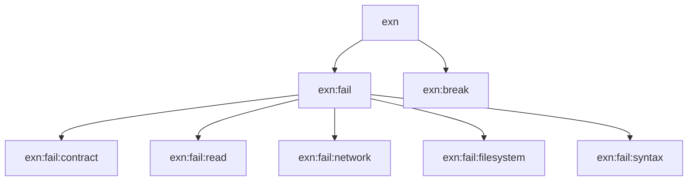

# 第 10 章 状態・入出力・例外

ここまで純粋な関数ばかり扱ってきましたが、**現実のプログラムは外の世界と関わる** 必要があります。ファイル読み書き、ユーザ入力、エラー処理、乱数 — これらを Racket 流に扱う方法を見ていきます。

## 10.1 `set!` とミュータブル束縛

Racket で破壊的代入は `set!` で行います。

```text
> (define n 0)
> (set! n (+ n 1))
> n
1
```

注意点:

1. `set!` は式として `(void)` を返す(値としては使えない)
2. `let` の束縛にも `set!` できる。クロージャと組み合わせるのが典型
3. **使うたびに「本当に必要か」を自問する**。多くの場合は純粋な書き方にリファクタできる

### 可変クロージャ(再掲)

```racket
(define (make-counter)
  (define n 0)
  (lambda ()
    (set! n (+ n 1))
    n))
```

状態を外に漏らさず、`set!` を内側で閉じ込めるのが Racket 流。

### 可変変数を避ける代替策

| 使いたいパターン | 代替 |
| --- | --- |
| 累積 | `foldl` / `for/fold` |
| 早期 return | 再帰で条件分岐 |
| ループ変数 | 名前付き `let` |
| グローバルキャッシュ | パラメータ(後述)/ ハッシュ |

## 10.2 入出力の基本

### 出力系

| 関数 | 用途 |
| --- | --- |
| `display` | 人間向け表示(クォート無し) |
| `write` | `read` で読める形 |
| `print` | REPL の既定表示(クォート付き) |
| `newline` | 改行 |
| `displayln` | `display` + 改行 |
| `printf` | フォーマット付き出力 |
| `fprintf` | ポート指定の `printf` |

```text
> (display "hello")
hello
> (newline)

> (printf "~a and ~a\n" 1 2)
1 and 2
```

フォーマット指定子の代表:

| 指定子 | 意味 |
| --- | --- |
| `~a` | `display` 相当 |
| `~s` | `write` 相当 |
| `~v` | `print` 相当 |
| `~n` | OS 依存改行 |
| `~~` | `~` 自身 |

### 入力系

標準入力を 1 行読むには `read-line`。式として読むには `read`。

```racket
(define line (read-line))
```

REPL で `read` を使うと、ユーザが打ち込んだ S 式を値として取り出せます。

```text
> (read (open-input-string "(1 2 3)"))
'(1 2 3)
```

`open-input-string` は「文字列を入力ポートとして開く」関数です。ポート抽象はファイル・文字列・ネットワーク接続などを統一的に扱うための仕組みです。

## 10.3 ポート — ファイル読み書き

### 書き込み

```racket
(with-output-to-file "/tmp/hello.txt"
  #:exists 'replace
  (lambda ()
    (displayln "Hello, Racket!")
    (printf "x = ~a\n" 42)))
```

`with-output-to-file` は、第 2 引数の関数を実行する **間だけ** 出力先をファイルに切り替えます。終わったら自動で閉じてくれるので、`try/finally` 相当の面倒を書かずに済みます。

### 読み込み

```racket
(define contents
  (with-input-from-file "/tmp/hello.txt"
    (lambda ()
      (port->string (current-input-port)))))
```

あるいはもっと簡潔に:

```racket
(define contents (file->string "/tmp/hello.txt"))
(define lines   (file->lines  "/tmp/hello.txt"))
```

### 文字列への「出力」

デバッグやテストで便利な技。

```text
> (with-output-to-string (lambda () (display "captured")))
"captured"
> (with-output-to-string (lambda () (printf "x=~a" 42)))
"x=42"
```

`current-output-port` を一時的に文字列ポートに差し替えてくれるので、**標準出力に書く関数をそのまま文字列化** できます。テストの時に重宝します。

## 10.4 パラメータ — 動的スコープの良い使い道

Racket には「動的束縛」のための道具 `parameter` があります。`current-output-port` や `current-directory` など、多くの標準設定がパラメータです。

```text
> (parameterize ([current-output-port (open-output-string)])
    (display "silent"))
```

- `(parameter-name)` で値を取得
- `parameterize` ブロックの中だけ値を差し替えられる
- **複数スレッドから見ても安全**

`parameterize` は第 5 章で学んだ `let` の「動的」版と考えると理解が早いです。

## 10.5 例外処理 — `with-handlers`

エラーが発生しうる処理を囲むときは `with-handlers` を使います。

```text
> (with-handlers ([exn:fail? (lambda (e) (exn-message e))])
    (/ 1 0))
"/: division by zero"
```

```racket
(define (safe-div a b)
  (with-handlers ([exn:fail? (lambda (e) 'error)])
    (/ a b)))
```

```text
> (safe-div 10 0)
'error
> (safe-div 10 2)
5
```

### 例外の階層

Racket の例外は階層構造を持っています(抜粋)。



`with-handlers` の左側は **述語**(`exn:fail?` のように `?` 付き) を書きます。`exn:fail?` は `exn:fail` とその子孫すべてに真となるので、普通のエラーをまとめて捕まえるにはこれで十分です。

### エラーの発生

自分でエラーを投げるには `error` か `raise`。

```racket
(define (positive-int! n)
  (unless (and (exact-integer? n) (positive? n))
    (error 'positive-int! "expected positive int, got ~v" n))
  n)
```

```text
> (positive-int! 10)
10
> (positive-int! -3)
; positive-int!: expected positive int, got -3
```

`error` の最初の引数がエラー元の識別子、続く文字列がフォーマット、以降が引数です。

### 後始末 — `dynamic-wind`

リソースの取得と解放を必ずセットにしたいときは `dynamic-wind` を使います。

```text
> (dynamic-wind
    (lambda () (displayln "before"))
    (lambda () (displayln "body") 42)
    (lambda () (displayln "after")))
before
body
after
42
```

`before → body → after` の順で実行され、`body` が例外を投げても **`after` は必ず実行される** のが保証されます。ファイルの `with-input-from-file` などは内部でこれを使っています。

## 10.6 文字列と数値の変換

入出力のついでに覚えておくと便利な変換関数群。

```text
> (string->number "42")
42
> (string->number "3.14")
3.14
> (string->number "oops")
#f
> (number->string 3.14)
"3.14"
> (string-split "a,b,c" ",")
'("a" "b" "c")
> (string-join '("a" "b" "c") "-")
"a-b-c"
```

`string->number` は **失敗時に `#f` を返す** タイプなので、`with-handlers` で包まなくても `if` や `cond` で安全に扱えます。

## 10.7 乱数

テストのためなどに押さえておきます。

```racket
(random)        ; => [0.0, 1.0) の浮動小数
(random 10)     ; => 0..9 の整数
(random 5 10)   ; => 5..9 の整数
```

乱数種を固定するには:

```racket
(define rng (make-pseudo-random-generator))
(parameterize ([current-pseudo-random-generator rng])
  (random-seed 42)
  (random 100))
```

## 10.8 小さなサンプル:ログ付きファイルコピー

これまでの道具を組み合わせて、簡単なファイルコピー関数を書いてみます。

```racket
#lang racket

(define (copy-with-log src dst)
  (unless (file-exists? src)
    (error 'copy-with-log "source not found: ~a" src))
  (dynamic-wind
    (lambda () (printf "[start] ~a → ~a~n" src dst))
    (lambda ()
      (with-output-to-file dst #:exists 'replace
        (lambda ()
          (with-input-from-file src
            (lambda ()
              (copy-port (current-input-port)
                         (current-output-port)))))))
    (lambda () (printf "[done ] ~a → ~a~n" src dst))))
```

使い方:

```text
> (copy-with-log "README.md" "/tmp/README-copy.md")
[start] README.md → /tmp/README-copy.md
[done ] README.md → /tmp/README-copy.md
```

例外時も `[done]` は必ず出ます。

## 10.9 本章のまとめ

- `set!` は必要なときだけ、原則は不変で考える
- `display` / `write` / `print` / `printf` の使い分け
- ポートで統一的にファイル・文字列・ネットワークを扱う
- パラメータは「スレッド安全な動的束縛」
- `with-handlers` で例外を捕まえ、`dynamic-wind` で後始末を保証
- 入出力ライブラリは `file->string` / `with-output-to-string` など読みやすい高水準 API が豊富

---

## 手を動かしてみよう

1. 標準入力から数を受け取り、素数なら `"prime"`、そうでなければ `"composite"` と返す関数を書きなさい。`read-line` と `string->number` を使うこと。数値でない入力には適切なエラーメッセージを出す。

2. 1 から 100 までの数について「FizzBuzz」の結果を `/tmp/fizzbuzz.txt` に書き出すプログラムを作りなさい。`with-output-to-file` を使うこと。

3. `safe-number` — 文字列を受け取り、数値化できれば数値を、できなければ `#f` を返す関数。`string->number` の仕様と組み合わせ、`with-handlers` は **使わないで** 書けます。
   ```racket
   (define (safe-number s)
     (or (string->number s) #f))
   ```
   ここで `or` を使う理由を、`#f` の意味と合わせて説明してください。

次章では、これまでのコードを **モジュール** として再利用可能な単位にまとめていきます。
