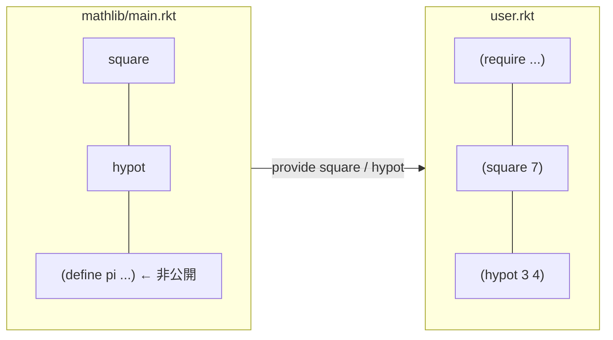

# 第 11 章 モジュールとパッケージ

ここまでは主に 1 ファイルの中で完結させてきました。本章では複数ファイルに分け、再利用可能な単位として組み上げていきます。

## 11.1 モジュールとは

Racket では **1 ファイル = 1 モジュール** が基本です。`#lang` 行で始まるファイルは暗黙のうちに名前付きモジュールになります。

```racket
#lang racket
(define (square x) (* x x))
```

これは次のモジュール宣言と意味的に等価です。

```racket
(module this-file racket
  (define (square x) (* x x)))
```

モジュール内の定義は、**他のモジュールからは `provide` しない限り見えません**。これは Python や JavaScript の ES Modules と同じ発想です。

## 11.2 `provide` と `require`

### 最小の例

ディレクトリ構成:

```text
examples/ch11/
├── mathlib/
│   └── main.rkt
└── user.rkt
```

`mathlib/main.rkt`:

```racket
#lang racket

(provide square hypot)

(define (square x) (* x x))
(define (hypot a b) (sqrt (+ (square a) (square b))))
```

`user.rkt`:

```racket
#lang racket
(require "mathlib/main.rkt")
(displayln (square 7))
(displayln (hypot 3 4))
```

実行:

```text
$ racket examples/ch11/user.rkt
49
5
```

### `provide` の書き方

| 形式 | 意味 |
| --- | --- |
| `(provide x y z)` | 指定した識別子を公開 |
| `(provide (all-defined-out))` | そのモジュールで定義したもの全部 |
| `(provide (rename-out [square sq]))` | 別名で公開 |
| `(provide (struct-out point))` | 構造体の全アクセサ/述語もまとめて |
| `(provide (contract-out ...))` | 契約(Contract)付きで公開(第 12 章) |

### `require` の書き方

| 形式 | 意味 |
| --- | --- |
| `(require "mathlib/main.rkt")` | 相対パス |
| `(require racket/list)` | 標準コレクションから |
| `(require (only-in racket/string string-join))` | 特定の識別子のみ |
| `(require (rename-in racket/format [~a format-a]))` | 別名で取り込み |
| `(require (prefix-in m: "mathlib/main.rkt"))` | 接頭辞付き(`m:square` のように使う) |

名前空間汚染を避けたいときに `only-in` や `prefix-in` が効きます。

## 11.3 モジュールの境界で何が起きているか



- `provide` したもの **だけ** が外から見える
- モジュール内部の束縛(`I` のような `pi`)は完全に隠される
- 循環 `require` は原則禁止(`racket/base` のようにごく一部の例外あり)

## 11.4 `submodule` — テストや補助コードを同じファイルに

1 つのファイル内に「テスト用」「main 用」「ドキュメント用」のサブモジュールを作れます。

```racket
#lang racket

(provide square)
(define (square x) (* x x))

(module+ test
  (require rackunit)
  (check-equal? (square 3) 9)
  (check-equal? (square 0) 0))

(module+ main
  (displayln "running as main")
  (displayln (square 5)))
```

実行してみると:

```text
$ racket square.rkt                  # main は走らない、普通の require 相当
$ racket -l racket/base -t square.rkt -m  # main を走らせる
running as main
25
$ raco test square.rkt               # test サブモジュールだけ走る
```

`module+` は「同じ名前の `module+` 群を集めて 1 つのサブモジュールとして定義する」マクロです。**テストを本体コードの近くに書ける** のが非常に快適で、小さなプロジェクトではこれだけで十分です。

## 11.5 相対パスと絶対パス

`require` のパス解決は次のルール:

| 書き方 | 解決先 |
| --- | --- |
| `"./foo.rkt"` / `"foo.rkt"` | 同ディレクトリ |
| `"../lib/foo.rkt"` | 親ディレクトリ |
| `racket/list` | コレクションパス(インストール済みライブラリ) |
| `file:"/abs/path.rkt"` | 絶対パス |

コレクションパスは `racket/base` のように `/` 区切り。`raco pkg install` で入れたパッケージもこの形式で参照されます。

## 11.6 パッケージ管理 `raco pkg`

公式パッケージサーバ <https://pkgs.racket-lang.org/> から必要なライブラリをインストールできます。

```bash
raco pkg install json          # 公式パッケージ
raco pkg install --auto json   # 依存も自動で
raco pkg update --all          # 全部更新
raco pkg remove json           # 削除
```

主要パッケージは最初から同梱されています(`racket/gui`, `racket/list`, `racket/match`, `web-server/servlet-env` など)。

## 11.7 自作パッケージを作ってみる

ディレクトリ構成例:

```text
my-toolbox/
├── info.rkt
├── main.rkt
└── scribblings/
    └── my-toolbox.scrbl
```

`info.rkt` はパッケージメタデータです。

```racket
#lang info
(define collection "my-toolbox")
(define deps '("base"))
(define build-deps '("rackunit-lib" "scribble-lib"))
(define scribblings '(("scribblings/my-toolbox.scrbl")))
```

`main.rkt`:

```racket
#lang racket
(provide greet)
(define (greet name) (string-append "hello, " name))
```

ローカルにインストール:

```bash
raco pkg install --name my-toolbox /path/to/my-toolbox
```

すると他のプロジェクトから

```racket
(require my-toolbox)
```

で使えます。後から修正しても再インストール不要で反映されます(`raco pkg install` はリンクを張る仕組みなので)。

## 11.8 大きなプロジェクトのレイアウト例

```text
my-app/
├── info.rkt
├── main.rkt              # エントリポイント
├── core/
│   ├── parser.rkt
│   ├── evaluator.rkt
│   └── printer.rkt
├── util/
│   ├── strings.rkt
│   └── numbers.rkt
└── tests/
    ├── parser-test.rkt
    └── evaluator-test.rkt
```

- エントリは `main.rkt`
- 機能ごとにディレクトリを切る
- テストは `tests/` または `module+ test` サブモジュール
- ドキュメントは `scribblings/` に Scribble で書く

この構成は Racket 公式パッケージでもよく見かける形で、小〜中規模アプリなら迷わず採用して構いません。

## 11.9 よくあるハマりどころ

### 1) `require` の相対パスで `.rkt` を省略してはいけない

```racket
(require "mathlib/main")       ; NG(コレクション扱い)
(require "mathlib/main.rkt")   ; OK
```

文字列パスで書くときは必ず拡張子を付けます。

### 2) `provide` し忘れると見えない

「動くはずなのに `unbound identifier`」 と言われたら、まず `provide` を確認しましょう。

### 3) モジュールのトップレベルは **1 回しか実行されない**

```racket
#lang racket
(provide f)
(displayln "top-level")
(define (f) 42)
```

これを複数のファイルから `require` しても、`"top-level"` は 1 回だけ出力されます。モジュールは自動的に **キャッシュ** されます。副作用を書くときはこの性質を意識しましょう。

## 11.10 本章のまとめ

- Racket は「1 ファイル 1 モジュール」が基本
- `provide` / `require` でインターフェースを明示
- `module+ test` / `module+ main` が軽量で強力
- パッケージは `raco pkg` で管理
- 大規模でもディレクトリを切れば素直にスケールする

---

## 手を動たしてみよう

1. `mathlib/main.rkt` に次の関数を追加し、`user.rkt` から呼んでみなさい。
   - `cube`: 3 乗
   - `hypot3`: 3 次元距離 `√(a² + b² + c²)`

2. `mathlib/main.rkt` に `module+ test` を追加し、`raco test mathlib/main.rkt` を走らせてみなさい。`rackunit` の `check-equal?` を使う。

3. 2 つのモジュール間で **循環依存** を作ろうとしてみなさい(`a.rkt` が `b.rkt` を require し、`b.rkt` が `a.rkt` を require)。Racket がどんなエラーを返すか観察してください。循環を避ける一般的な方法を言葉でまとめましょう(ヒント: 共通部分を 3 つ目のモジュールに抜き出す)。

次章では、ここで書いたモジュールに **契約とテスト** を組み込み、堅牢にしていきます。
