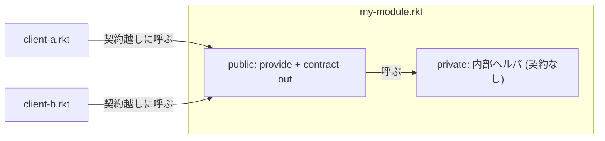

# 第 12 章 テストと契約プログラミング

第 11 章で `module+ test` に触れました。この章ではテストフレームワーク `rackunit` と、Racket ならではの **契約(contract)** を掘り下げます。

## 12.1 `rackunit` — Racket 標準のテストライブラリ

最小の使い方。

```racket
#lang racket

(define (fact n) (if (<= n 1) 1 (* n (fact (- n 1)))))
(provide fact)

(module+ test
  (require rackunit)
  (check-equal? (fact 0) 1)
  (check-equal? (fact 5) 120)
  (check-equal? (fact 10) 3628800))
```

このファイルを `fact.rkt` として保存し、`raco test` で実行:

```text
$ raco test fact.rkt
raco test: (submod "fact.rkt" test)
3 tests passed
```

テストが通ると 1 行で「何件通ったか」を表示してくれます。DrRacket からは `Racket → Test` メニューで実行できます。

### 主要なアサーション

| マクロ | 意味 |
| --- | --- |
| `check-equal?` | `equal?` で比較。**最もよく使う** |
| `check-eq?` / `check-eqv?` | 等価性のレベル違い |
| `check-=` | 浮動小数に許容誤差を付けた比較 |
| `check-pred` | 述語が真になるか |
| `check-true` / `check-false` | そのまま |
| `check-exn` | 特定の例外が上がることを検証 |
| `check-not-exn` | 例外が上がらないことを検証 |
| `check-match` | パターンマッチに合うか |
| `fail` | 無条件に失敗(到達しないはずの地点に置く) |

### `check-exn` の例

```racket
(module+ test
  (require rackunit)
  (check-exn exn:fail:contract?
             (lambda () (car '()))))
```

関数呼び出し形を **サンク(`lambda ()`)で包む** ところがポイント。`car` を直接評価してしまうと、テストの前にエラーで落ちてしまうからです。

### `test-case` でグルーピング

```racket
(module+ test
  (require rackunit)
  (test-case "fact の基本"
    (check-equal? (fact 0) 1)
    (check-equal? (fact 1) 1))
  (test-case "fact は正整数の積"
    (check-equal? (fact 5) 120)
    (check-equal? (fact 10) 3628800)))
```

失敗時に `test-case` の名前が出るので、どこで落ちたかが分かりやすくなります。

### `test-suite` と `run-tests`

コマンドラインではなくプログラムで実行したい場合:

```racket
(require rackunit rackunit/text-ui)

(define my-tests
  (test-suite
   "fact tests"
   (check-equal? (fact 5) 120)))

(run-tests my-tests)
```

CI や自動化で便利です。

## 12.2 Coverage とプロパティベーステスト

### カバレッジ

```text
$ raco cover fact.rkt
```

HTML でカバレッジレポートを出してくれます(`raco pkg install cover` が必要)。

### プロパティベーステスト

`rackcheck` パッケージで QuickCheck 風にも書けます。

```racket
(require rackcheck)

(check-property
 (property
  ([n (gen:integer-in 0 100)])
  (= (fact n) (* n (fact (- n 1))))))
```

本書の範囲を超えるので詳細は省きますが、「ランダムな入力でプロパティを確かめる」世界が Racket にもあります。

## 12.3 契約(contract) — 関数の「約束」

Racket を語る上で欠かせない機能が **contract** です。ざっくり言えば「関数の入出力に型・条件を宣言し、破られたら実行時エラーにする」仕組みです。

### 最小の例

```racket
#lang racket

(provide (contract-out
          [divide (-> number? (and/c number? (not/c zero?)) number?)]))

(define (divide a b) (/ a b))
```

```text
> (divide 10 2)
5
> (divide 10 0)
; divide: contract violation
;   expected: (and/c number? (not/c zero?))
;   given: 0
```

見どころ:

- `provide (contract-out ...)` で公開時に契約を付ける
- `(-> ドメイン1 ドメイン2 ... レンジ)` が関数型の契約
- `and/c`, `or/c`, `not/c` で組み合わせ
- 契約違反は **呼び出し側** のエラーとして報告される

### 型ではなく契約?

Typed Racket で静的型付けもできます(第 17 章で触れます)。Racket で伝統的に使われているのは契約の方で、次のような違いがあります。

|観点|契約(contract)|型(typed/racket)|
|---|---|---|
|検査タイミング|実行時|コンパイル時 |
|記述力|`positive?` のような述語がそのまま使える|関数型や多相は強力だが複雑|
|他モジュールとの相互運用|契約越しに普通の racket と混在可|型 ⇔ 非型の境界は複雑|
|パフォーマンス|若干のオーバーヘッド|型削除でほぼゼロ|

実務では「ライブラリの公開 API は contract-out、内側は型に限らない」 くらいのバランスが心地よいです。

### よく使う契約コンビネータ

| 契約 | 意味 |
| --- | --- |
| `number?`, `string?`, `symbol?`, `boolean?` | 単独述語 |
| `(and/c c1 c2)` | 両方を満たす |
| `(or/c c1 c2)` | どちらかを満たす |
| `(not/c c)` | 満たさない |
| `(listof c)` | c からなるリスト |
| `(vectorof c)` | c からなるベクタ |
| `(cons/c c1 c2)` | 具体的な cons |
| `(-> d1 d2 ... r)` | 関数 |
| `(->* (必須...) (任意...) r)` | 可変長引数 |
| `(->i ...)` | 引数の **依存関係** を書ける(後述) |
| `any/c` | 何でも |
| `any` | 関数の結果を問わない(複数値も OK) |

### 例:リストに対する契約

```racket
(provide (contract-out
          [nonempty-head (-> (and/c list? (not/c empty?)) any/c)]))

(define (nonempty-head xs) (car xs))
```

```text
> (nonempty-head '(1 2 3))
1
> (nonempty-head '())
; nonempty-head: contract violation
;   expected: (and/c list? (not/c empty?))
;   given: '()
```

関数が「空でないリスト」を期待していることが **型注釈として読める** し、違反時はメッセージも親切。

### `->i` — 依存契約

「第 2 引数は第 1 引数の長さより小さくないといけない」のような条件も書けます。

```racket
(provide (contract-out
          [nth (->i ([xs (listof any/c)]
                     [i (xs) (and/c exact-nonnegative-integer?
                                    (</c (length xs)))])
                    [result any/c])]))

(define (nth xs i) (list-ref xs i))
```

```text
> (nth '(a b c) 1)
'b
> (nth '(a b c) 5)
; nth: contract violation
;   expected: (and/c exact-nonnegative-integer? (</c (length xs)))
;   given: 5
```

契約の読みやすさは整理された表記のおかげです。複雑な制約を言葉で書くより、契約として書いた方が明快なことが多い。

## 12.4 モジュール境界での責任分離

契約は **モジュール境界** にかけるのが基本です。内部の小さなヘルパー関数には普通付けません。



- **内部**: 速度を犠牲にせず自由に書く
- **境界**: 契約で保護して「ライブラリの利用者を信頼しない」

これが Racket 流の「攻めと守りの分離」です。

## 12.5 例:テスト + 契約 + モジュール

```racket
#lang racket

(provide (contract-out
          [safe-sqrt (-> (>=/c 0) (>=/c 0))]))

(define (safe-sqrt x)
  (sqrt x))

(module+ test
  (require rackunit)
  (check-equal? (safe-sqrt 0) 0)
  (check-equal? (safe-sqrt 25) 5)
  (check-exn exn:fail:contract?
             (lambda () (safe-sqrt -1))))

(module+ main
  (for ([x (in-list '(0 1 4 9 16 25))])
    (printf "~a の平方根 = ~a~n" x (safe-sqrt x))))
```

実行:

```text
$ raco test safe-sqrt.rkt
raco test: (submod "safe-sqrt.rkt" test)
3 tests passed

$ racket -t safe-sqrt.rkt -m
0 の平方根 = 0
1 の平方根 = 1
4 の平方根 = 2
9 の平方根 = 3
16 の平方根 = 4
25 の平方根 = 5
```

1 ファイルで「公開 API + 契約 + テスト + メイン」 が収まっているのが見えます。初期の小さなプロジェクトはこの形で十分です。

### 注意:`module+ test` からは契約違反が観測できない

実装と同じファイルの `module+ test` からは、**`contract-out` の契約は発火しません**。`module+` のサブモジュールは「外部クライアント」とみなされず、契約ラッパなしで直接触れるからです。

```racket
#lang racket
(provide (contract-out [f (-> (>=/c 0) (>=/c 0))]))
(define (f x) (sqrt x))

(module+ test
  (require rackunit)
  ;; これは通らない(contract-out が発火せず 0+1i が返る)
  (check-exn exn:fail:contract? (lambda () (f -1))))
```

契約違反を本当にテストしたいときは、**別の .rkt ファイル** から `require` しましょう。本書の `examples/ch12/contracts-user.rkt` が例です。

```text
$ racket examples/ch12/contracts-user.rkt
safe-sqrt -1 → safe-sqrt: contract violation
  expected: (>=/c 0)
  given: -1
  ...
```

## 12.6 契約のパフォーマンス

契約を有効にするには当然、呼び出し時にチェックを走らせます。数値演算を数百万回するようなホットパスでは、契約を **境界だけ** にし、内側の補助関数には付けないのが基本方針。

さらに速度を求めるなら `#lang racket/base` ベースで書き、内側を `require` します。`racket` は `racket/base` + 多数のライブラリで、起動やロードが重めです。

## 12.7 本章のまとめ

- `rackunit` + `module+ test` で、テストを小さく近くに書く
- `raco test` でまとめて実行、DrRacket なら `Racket → Test`
- 契約は **公開 API の境界** で使うのがコツ
- 契約コンビネータ(`and/c`, `or/c`, `listof`, `->`, `->i`)で直感的に書ける
- 型静的検査が欲しければ Typed Racket も選べる

---

## 手を動かしてみよう

1. 第 6 章で書いた `fib-iter` に `rackunit` のテストを少なくとも 5 件書き、`raco test` で通しなさい。

2. 次の `divide` を `contract-out` で公開し、以下の要件を満たすよう契約を作りなさい。
   - 第 1 引数は任意の数値
   - 第 2 引数は **0 でない** 数値
   - 結果は数値
   - 結果が負になる場合は契約違反にする(**ポストコンディション**)
   - ヒント: `->i` のレンジに条件を書く

3. `string-join` の契約を自分で考えてみなさい。どんな入力を受け、どんな結果を返す関数か?

次章からは、いよいよ **ハンズオン編** に入ります。画像 DSL を作って、関数合成の力を目で見て味わいます。
