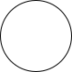
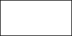
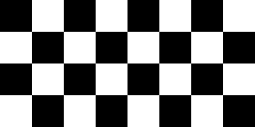
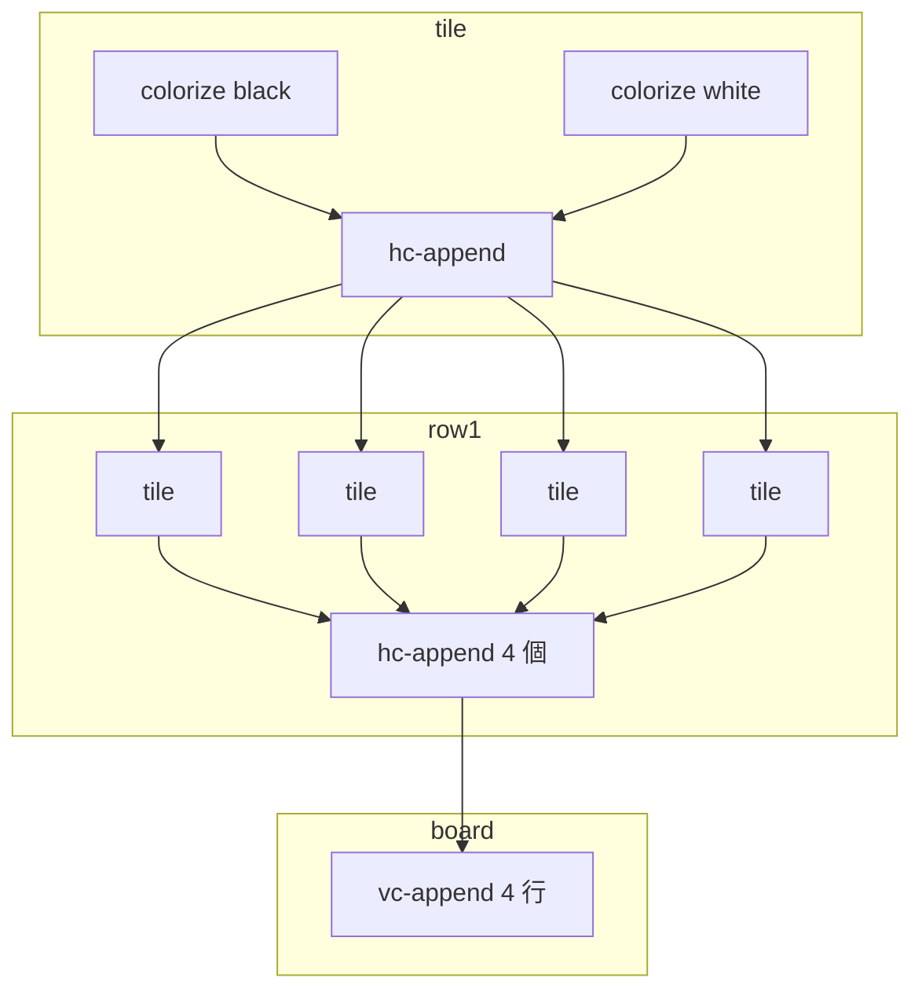
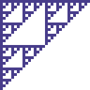
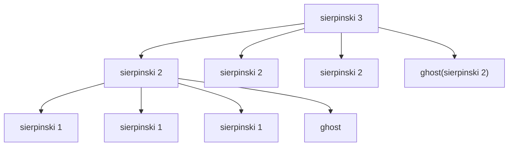

# 第 13 章 画像 DSL を書く — ハンズオン 1

この章はハンズオン編の最初で、**`pict` ライブラリ** を使って画像を組み立てます。公式 *Quick: An Introduction to Racket with Pictures* の発想を拡張し、「関数合成で絵を描く」という Lisp の楽しみをじっくり味わいます。

本章の例を実行するには、Racket 標準ライブラリに含まれる `pict` を `require` するだけです(インストール不要)。

```racket
#lang racket
(require pict)
```

## 13.1 画像もただの値

`pict` の世界では、画像は **値** として扱えます。関数が画像を返し、関数が画像を受け取る。組み合わせでどんどん新しい画像を作っていけます。

```racket
(define c (circle 80))
```

これは「直径 80 の円」という **pict 値** を `c` に束縛した、というだけ。REPL で `c` を評価すると画像自体は表示されませんが(ターミナル上では無理)、DrRacket の REPL ではそのまま描画されます。

`pict->bitmap` でビットマップに変換し、ファイルに保存できます。

```racket
(require racket/draw)
(define (save-pict p path)
  (send (pict->bitmap p) save-file path 'png))

(save-pict (circle 80) "01-circle.png")
```



こんな調子で絵を「作って、保存して、確かめる」サイクルを回していきます。実行スクリプトは `examples/ch13/gen-images.rkt` にあります。

## 13.2 基本図形

| 関数 | 意味 |
| --- | --- |
| `(circle d)` | 円(中身は透明) |
| `(disk d)` | 塗りつぶし円 |
| `(rectangle w h)` | 長方形 |
| `(filled-rectangle w h)` | 塗りつぶし長方形 |
| `(line dx dy)` | 相対移動の線分 |
| `(text str)` | 文字 |

試してみます。

```racket
(rectangle 120 60)
```



## 13.3 色を付ける — `colorize`

`colorize` は **既存の pict に色を被せる** 関数です。関数が画像を受けて画像を返すので、合成が気持ちいい。

```racket
(colorize (filled-rectangle 100 60) "coral")
```


色は CSS 色名か `(make-color r g b)` で渡せます。

## 13.4 合成 — `hc-append` / `vc-append`

複数の画像を横や縦に並べるコンビネータ。

```racket
(hc-append 20
           (colorize (filled-rectangle 60 60) "tomato")
           (colorize (disk 60)                "royalblue")
           (colorize (filled-rectangle 60 60) "olivedrab"))
```


縦並び:

```racket
(vc-append 10
           (colorize (filled-rectangle 100 30) "tomato")
           (colorize (filled-rectangle 100 30) "gold")
           (colorize (filled-rectangle 100 30) "dodgerblue"))
```


- 先頭の数値は **画像の間隔(px)**
- `hc` / `vc` の `c` は center 揃え。ほかに `ht/hb/vc` などバリエーション多数

このライブラリは **関数の名前が操作そのもの** で、「`hc-append` → horizontal center append」のように読めば意味が直感的に分かります。

## 13.5 回転 — `rotate`

```racket
(rotate (colorize (filled-rectangle 100 40) "teal") (/ pi 6))
```


- 角度はラジアン
- `/ pi 6` は 30°
- 回転すると外接矩形が拡大するので、配置時に注意

## 13.6 関数合成で作る — チェック盤

`tile` という関数を作って、それを `for/list` で並べるだけでパターンが作れます。

```racket
(define (tile color1 color2)
  (hc-append (colorize (filled-rectangle 40 40) color1)
             (colorize (filled-rectangle 40 40) color2)))

(define row1 (apply hc-append (make-list 4 (tile "black" "white"))))
(define row2 (apply hc-append (make-list 4 (tile "white" "black"))))
(define board
  (apply vc-append
         (for/list ([i (in-range 4)])
           (if (even? i) row1 row2))))
```



ここには Lisp の気持ちよさが詰まっています。

- `tile` は「2 色を受け取って 1 つのタイルを返す関数」
- `row1` / `row2` はタイルを 4 つ横に並べた画像
- `board` は行を縦に並べたもの
- **関数の合成だけで** 画像が組み上がっている

図解します。



## 13.7 再帰で描く — フラクタル風の図形

再帰関数で画像を作るのが、`pict` の真骨頂です。小さな画像を 3 分割・4 分割して自分自身を埋め込めば、**シェルピンスキー三角形** のようなフラクタルが書けます。

```racket
(define (sierpinski n)
  (cond
    [(= n 0)
     (colorize (filled-rectangle 4 4) "darkslateblue")]
    [else
     (let ([small (sierpinski (- n 1))])
       (vc-append (hc-append small small)
                  (hc-append small (ghost small))))]))
```

- `n = 0` のときは小さな 4×4 の正方形(ベースケース)
- それ以外では自分より 1 段小さい画像を 4 カ所に配置
- 右下だけ `ghost`(場所だけ残して描かない)にすることで穴を作る



再帰の深さを変えると模様の細かさが変わります。`(sierpinski 5)` は 4^5 = 1024 個のピクセルブロックに相当します。

### 展開の木



画像を作るアルゴリズム自体が **木構造の再帰** と同型です。ここに Lisp の「コードとデータの相似性」が現れています。

## 13.8 DSL として見る

Racket の世界では `hc-append`、`vc-append`、`colorize`、`rotate` のような組み合わせ関数群を **DSL(ドメイン固有言語)** と呼びます。その言語の「語彙」だけを使って、絵を記述しているからです。

DSL を作るときのコツ:

1. **基本単位** を決める(`pict` では円・矩形・文字など)
2. **組み合わせ方** を決める(`hc-append`, `vc-append`, `rotate`, ...)
3. **合成則** を守る(受け取る型と返す型を同じにする)

`pict` は「`pict`(画像)を受け取り、`pict` を返す関数」で統一されているので、どれだけ組み合わせても常に `pict` が返ります。この **閉じた代数** が DSL 設計の要です。

他言語でも「ビルダーパターン」や「fluent API」でこういう組み上げはできますが、Racket の **関数の組み合わせ** という素直さは群を抜いています。

## 13.9 まとめ

- `pict` は画像を「値として扱う」 DSL
- 関数合成で画像を組み立てる発想は Lisp 的
- 再帰で自己相似な図形が自然に描ける
- DSL の設計は「基本単位・組み合わせ・閉じた型」

---

## 手を動かしてみよう

1. 「赤い円を中心に、青い正方形を 4 つその上下左右に等距離で並べた」画像を作りなさい。`hc-append` と `vc-append` と `cc-superimpose`(中心重ね)を使うとよい。
   ```racket
   (define center (colorize (disk 50) "red"))
   (define sq    (colorize (filled-rectangle 30 30) "blue"))
   (cc-superimpose
     center
     (vc-append 60 sq (blank 50) sq))
   ```

2. 数値 `n` を受け取って、n 階のハノイの塔のビジュアルを生成する関数を書きなさい(3 本の棒の上に円盤を重ねる)。各円盤の幅は `(* 20 (+ i 1))` くらい、高さは 10。最上段は細く、下段は太く。

3. `(sierpinski n)` を `n = 1..6` で並べて横に描き、深さが増えると複雑さが増していく様子を 1 枚の画像にしなさい。ヒント:
   ```racket
   (apply hc-append 20 (for/list ([n (in-range 1 7)]) (sierpinski n)))
   ```

次章は Racket の最大の山場、**小さな Lisp インタプリタを自分で作る** ハンズオンに進みます。
