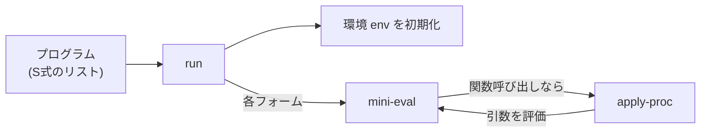

# 第 14 章 小さな Lisp 処理系を作る — ハンズオン 2

Lisp を学んだら、**一度は Lisp を Lisp で書いてみる** のが最高の理解法です。Peter Norvig の "Lispy" 系記事でも有名な古典ハンズオンを、日本語で丁寧に追体験しましょう。

完成形のソースは `examples/ch14/mini-lisp.rkt` にあります。本章を読みながら自分でも 1 行ずつ写経していくと、**「言語処理系って実はこの程度の量で作れる」** という感覚が掴めます。

## 14.1 どこまで作るか

以下を扱う mini-lisp を作ります。

- 数値 / 真偽値 / 文字列 / シンボル
- `define` によるトップレベル束縛(関数・値両方)
- `lambda` による無名関数とクロージャ
- `if`, `let`, `quote`
- 算術: `+ - * / = < >`
- リスト: `cons car cdr list null?`
- 再帰を含む任意のユーザ定義関数

末尾呼び出し最適化やマクロは対象外にします(章末で拡張のヒントを示します)。

## 14.2 全体像

処理系の流れは以下の通り。Racket のリーダに S式の読み取りは任せるので、**評価だけ自作** します。



評価器 `mini-eval` は「**式** と **環境** を受け取って値を返す関数」です。Lisp インタプリタの王道設計です。

役割分担をもう少し細かく書くと:

| 関数 | 入力 | 出力 | やること |
|------|------|------|----------|
| `run` | プログラム (S式のリスト) | 最後の式の値 | ルート環境を作り、各フォームを順に評価 |
| `mini-eval` | 式 + 環境 | 値 | `match` で式の形に応じて分岐 |
| `apply-proc` | 関数値 + 引数のリスト | 値 | クロージャなら body を拡張環境で評価、組み込みなら Racket の `apply` |
| `eval-body` | 式のリスト + 環境 | 最後の式の値 | 本体の複数式を順に評価 (途中は値を捨てる) |

Racket の **リーダ** (字句解析+構文解析) は `(define (f x) (+ x 1))` のようなソースを、最初から **リストとシンボルの入れ子** に変換してくれています。だから mini-lisp は「文字列をパースする」必要がなく、受け取ったリストを見て評価するだけで済みます。これが Lisp が自作言語の題材として最小で済む最大の理由です。

## 14.3 環境の設計

他言語のインタプリタでも登場する概念。「変数名 → 値」のマップで、**局所スコープを積み重ねる** ために複数フレームを持ちます。

mini-lisp では 2 段構成にします。

- **局所フレーム**: `let` や関数呼び出しで増える。連想リスト `((name . val) ...)` を積み重ねたスタック。
- **グローバル**: `define` の結果。ハッシュマップで可変。

なぜ 2 段かというと、**再帰関数と相互再帰関数** が動くようにするためです。`(define (fact n) ...)` のクロージャは定義時点の環境を捕まえますが、その環境が `fact` 自身を指せるためには、束縛後に中身が増やせる = グローバルが mutable である必要があります。もし純粋な不変リストで全部済ませようとすると、クロージャを作った瞬間には自分自身がまだ環境に入っていないので `unbound: fact` で落ちます。

環境を保持する構造体は次のとおり。

```racket
(struct env (frames globals) #:transparent)

(define (make-root-env)
  (define g (make-hash))
  (hash-set*! g
              '+ + '- - '* * '/ /
              '= = '< < '> >
              'cons cons 'car car 'cdr cdr 'list list
              'null? null? 'not not)
  (env '() g))
```

細かい点を順に解説します。

- `struct` で 2 フィールド (`frames`, `globals`) を持つ型を宣言。`env-frames`、`env-globals`、コンストラクタ `env` が自動生成されます。
- `#:transparent` を付けると、デバッグ時に中身がそのまま表示され、`equal?` も構造的に比較できます。インタプリタの中身を覗きやすくしておくのはデバッグの基本。
- `make-hash` は **可変** なハッシュ。不変版は `hash` や `make-immutable-hash`。mutable を選ぶのは再代入を許すため。
- `hash-set*!` は「キーと値を交互に並べて一気にセット」するための便利関数。`(hash-set*! g 'k1 v1 'k2 v2 ...)`。
- 組み込み手続きは最初から `globals` に入れておきます。ポイントは **シンボル `'+` に Racket の関数 `+` を紐付けている** こと。こうしておくと、評価器側は `+` を「ただの変数参照」として処理できて、算術演算の特別扱いが不要になります (= 実装が減る)。
- 最後の `(env '() g)` が戻り値。局所フレームは空リスト、グローバルだけが中身を持った初期状態です。

環境の拡張・検索は以下。

```racket
(define (extend-env e names values)
  (env (cons (map cons names values) (env-frames e))
       (env-globals e)))

(define (env-set-global! e name value)
  (hash-set! (env-globals e) name value))

(define (env-lookup e sym)
  (let loop ([frames (env-frames e)])
    (cond
      [(null? frames)
       (hash-ref (env-globals e) sym
                 (lambda () (error 'lookup "unbound: ~v" sym)))]
      [(assoc sym (car frames)) => cdr]
      [else (loop (cdr frames))])))
```

各関数をもう少し丁寧に読み解きましょう。

**`extend-env`** は 1 フレーム積むだけの関数です。`names` と `values` は同じ長さのリストで、`(map cons names values)` によって `((n1 . v1) (n2 . v2) ...)` という連想リストを組み立て、それを既存フレームの先頭に `cons` で積みます。globals は共有したままです。例:

```racket
(extend-env e '(x y) '(10 20))
;; 手前に ((x . 10) (y . 20)) という連想リストが 1 段積まれる
```

**`env-set-global!`** は名前が `!` で終わる通り破壊的。ハッシュを直接書き換えます。`define` の実装で呼び出します。

**`env-lookup`** は変数参照の中核。名前付き `let` (`let loop`) で局所フレームを手前から探索し、見つからなければ globals を引きます。

- `assoc` はキーが見つからないと `#f`、見つかれば `(key . value)` のドット対を返します。
- `cond` の `=>` は「テスト式の値が真なら、その値を関数に渡して呼ぶ」という Scheme 由来の便利記法です。つまり

```racket
[(assoc sym (car frames)) => cdr]
```

は次と等価です。

```racket
[(assoc sym (car frames))
 => (lambda (matched) (cdr matched))]
;; つまり「assoc の戻り値が #f でなければ、その値を cdr に渡す」
```

`=> cdr` と書くと、**1 回だけ呼ぶ `assoc` の結果を再評価せずに値として取り出せる** のでコードが短くなります (自前で `let` を書いて一時変数に保存する必要が消える)。

- `hash-ref` は第 3 引数に **引数 0 の関数 (thunk)** を渡せます。キーが無いときだけ呼ばれるので、ここでエラーを投げています。第 3 引数に「値そのもの」を渡しても動きますが、**エラーを投げたい時は thunk の方が自然** です (値の方だと常に評価されてしまうため)。

## 14.4 評価器の骨格

```racket
(define (mini-eval expr e)
  (match expr
    [(? number?)   expr]
    [(? boolean?)  expr]
    [(? string?)   expr]
    [(? symbol?)   (env-lookup e expr)]
    [(list 'quote datum) datum]
    [(list 'if c a b)
     (if (mini-eval c e)
         (mini-eval a e)
         (mini-eval b e))]
    [(list* 'lambda params body)
     (list 'closure params body e)]
    [(list* 'let bindings body)
     (define names (map car  bindings))
     (define vals  (map (lambda (b) (mini-eval (cadr b) e)) bindings))
     (eval-body body (extend-env e names vals))]
    [(cons f args)
     (apply-proc (mini-eval f e)
                 (map (lambda (a) (mini-eval a e)) args))]))
```

評価器が `match` でほぼ **表の形** に書けているのが Lisp の美しさです。それぞれの節を読み解きます。

### (? number?) / (? boolean?) / (? string?)

`(? 述語)` は match の「述語パターン」で、「式に `number?` を適用して真ならマッチ」という意味。「数値・真偽値・文字列は **それ自身が値** (自己評価式)」というルールをそのまま書いているだけです。

### (? symbol?)

シンボルは **変数名**。環境を引いて値を返します。`'foo` のような「クォートされたシンボル」はこの節に落ちて来ないことに注意 — そちらは先に `(list 'quote datum)` 節でキャッチされるからです。

### `(list 'quote datum)`

`'(+ 1 2)` のようなリテラル。Racket のリーダは `'x` を `(quote x)` に展開しているので、`(list 'quote datum)` パターンで拾えば `datum` にリテラル値が束縛されます。評価せずそのまま返すのがポイント。これが無いと `'(a b c)` は「関数 `a` を `b` と `c` に適用」として誤解釈されます。

### `(list 'if c a b)`

条件分岐。`c` を評価し、結果が真なら `a` を、偽なら `b` を評価します。**短絡評価**: 選ばれなかった枝は評価されません。Racket では `#f` だけが偽、それ以外 (空リスト `'()` や数値 `0` も!) は真扱いなことに注意。

### `(list* 'lambda params body)`

関数リテラル。**評価時点の環境 `e` を閉じ込めて** 4 要素のタグ付きリストを返します。これが **クロージャの実装** です。

```racket
(list 'closure params body e)
;; =>  '(closure (x y) ((+ x y)) #<env>)
```

`list*` は `list` + `cons` を混ぜたような記法で、`(list* 'lambda params body)` は `(cons 'lambda (cons params body))` と等価です。ここで `body` に「**本体式のリスト**」がマッチするのがミソ — `(lambda (x) (print x) (+ x 1))` のように本体に複数式を書けます。もし `(list 'lambda params body)` (= 要素数 3 固定) と書くと、本体が 1 式のラムダしか受け付けなくなります。

### `(list* 'let bindings body)`

局所束縛。束縛式を **現在の環境** で評価してから、新しいフレームを積んで本体を評価します。

```racket
(define names (map car  bindings))                      ; 左辺の名前たち
(define vals  (map (lambda (b) (mini-eval (cadr b) e))  ; 右辺を評価
                   bindings))
(eval-body body (extend-env e names vals))
```

右辺の評価を「**現在の環境 `e`** で」行うのが重要です。まだ拡張していない環境で評価するので、同じ `let` 内の他の束縛は見えません (= 同時束縛 / `let*` ではない)。例えば `(let ([x 1] [y x]) y)` の `y` 側の `x` は、**外側の** `x` を参照し、この `let` の `x=1` は参照しません。

### `(cons f args)`

これが **通常の関数呼び出し**。特殊フォームの節に全てマッチしなかった cons はここに落ちてきます。`f` も `args` もすべて評価してから `apply-proc` に渡します (= 値呼び / eager evaluation、左から右の順)。

**`match` の節は上から順にチェックされる** ので、特殊フォーム (`if`, `lambda`, `let`, `quote`) は必ず `(cons f args)` より先に並べる必要があります。順序を間違えると、たとえば `lambda` というシンボルが変数として評価されようとしてエラーになります。

## 14.5 関数適用

```racket
(define (apply-proc proc args)
  (match proc
    [(list 'closure params body captured-env)
     (eval-body body (extend-env captured-env params args))]
    [(? procedure?)
     (apply proc args)]
    [else (error 'apply "not a procedure: ~v" proc)]))

(define (eval-body exprs e)
  (cond
    [(null? (cdr exprs)) (mini-eval (car exprs) e)]
    [else
     (mini-eval (car exprs) e)
     (eval-body (cdr exprs) e)]))
```

呼ぶ対象は 2 種類あり得ます。

- **ユーザ定義関数** は `('closure params body env)` の形 (4 要素リスト)。肝心なのは「`captured-env`」 — **定義されたときの** 環境です。ここに **呼ばれたときの実引数** を `extend-env` で積み、その環境で本体を評価します。この「定義時点の環境を使う」挙動が **レキシカル (静的) スコープ** の実装そのもの。動的スコープにするには `captured-env` の代わりに呼び出し元の環境を渡すことになります。
- **組み込み関数** は Racket 側の関数そのもの (`procedure?` で判定)。Racket の `apply` で呼ぶだけ。`+` や `car` は Racket の関数を globals に載せておいたので、何の変換もなくそのまま使えます。
- それ以外 (数値や文字列を関数として呼ぼうとした、など) はエラー。

`eval-body` は「式の列を順に評価し、最後の式の値を返す」だけの関数です。途中の式の値は捨てる (副作用目的)。`(null? (cdr exprs))` で「残り 1 式だけ」になったら最後の評価結果を返す、という末尾呼び出し型の書き方です。呼び出し元 (`lambda` の本体、`let` の本体) が複数式を許すので、この関数が必要になります。

## 14.6 トップレベル `run`

```racket
(define (run program)
  (define e (make-root-env))
  (for/last ([form (in-list program)])
    (match form
      [(list 'define (cons name params) body ...)
       (env-set-global! e name
                        (mini-eval `(lambda ,params ,@body) e))
       (void)]
      [(list 'define name expr)
       (env-set-global! e name (mini-eval expr e))
       (void)]
      [else (mini-eval form e)])))
```

要点を順に。

- `(define (f x) ...)` と `(define f ...)` の **2 形をサポート**。前者は関数定義の短縮形で、後者は「式を名前に束縛する」汎用形。
- 関数定義はトップレベル限定の特殊フォーム扱いにしてここだけで処理します (`mini-eval` の中には `define` 節を置かない)。これで入れ子の `define` を考えなくて済み、実装が簡単に。
- `body ...` は match の「残り全部」パターン。本体が何式あっても `body` にリストで束縛されます。
- `(list 'define (cons name params) body ...)` のパターンでは、第 2 要素 `(f x y)` を `(cons name params)` で分解して `name=f`, `params=(x y)` に同時束縛。
- 関数定義の中身は **クォッシクォート (`` ` ``)** で lambda 式を組み立てて再帰的に `mini-eval` に渡しているだけ。

```racket
`(lambda ,params ,@body)
;; = (list 'lambda params の中身を埋め込み、body を展開して埋め込み)
```

`,` (unquote) はその式を評価して埋め込み、`,@` (unquote-splicing) は「リストを展開して埋め込み」です。これで「`define (f x y) e1 e2`」から「`(lambda (x y) e1 e2)`」に変換 → `mini-eval` してクロージャを得る、という流れになり、**関数定義が lambda の糖衣構文である** ことがコードからも読めます。

- `(void)` を返すのは「`define` 自身の値は未定義」を表現するため。`for/last` は最後の反復の値を返しますが、define がプログラムの最後に来ても問題ない (= プログラムの値にならない) のは `void` だから。
- `for/last` は「各反復の値のうち最後のものを返す」専用マクロ。プログラム末尾の式の値をそのままトップレベルの戻り値にできるので、インタプリタの REPL 風な返り値設計に便利。

## 14.7 動作確認

```racket
(define program
  '((define (square x) (* x x))
    (define (fact n)
      (if (< n 2) 1 (* n (fact (- n 1)))))
    (define (my-map f xs)
      (if (null? xs) '()
          (cons (f (car xs)) (my-map f (cdr xs)))))
    (list (square 7)
          (fact 6)
          (my-map square '(1 2 3 4 5)))))

(run program)
```

実行:

```text
$ racket examples/ch14/mini-lisp.rkt
(49 720 (1 4 9 16 25))
```

`square`、再帰版 `fact`、`my-map` が mini-lisp 内で動いています。組み込みの `map` は提供していないのに、`my-map` をユーザ定義で書くと普通に動く。これが **関数とクロージャだけで言語を構築する** Lisp の醍醐味です。

### 内部の動きを追ってみる

例として `(square 7)` が評価される過程を追うと、次のようになります。

1. `run` がフォーム `(square 7)` を受け取り、`else` 節で `mini-eval` に渡す。
2. `(cons f args)` 節にマッチ。`f=square`, `args=(7)`。
3. `f` を評価 → `env-lookup` で globals から `square` を引いて `(closure (x) ((* x x)) <root-env>)` が返る。
4. `args` の 7 を評価 → そのまま 7。
5. `apply-proc` が呼ばれ、closure 節にマッチ。
6. `extend-env captured-env '(x) '(7))` で環境を 1 フレーム拡張 → `((x . 7))` が先頭に積まれる。
7. 拡張環境で `(* x x)` を `mini-eval`。
8. `(cons f args)` 節にマッチ、`f=*`, `args=(x x)`。
9. `*` は globals にある Racket の関数、`x` は局所フレームを引いて 7。
10. `(apply * '(7 7))` → 49 が返り、それが `square` の戻り値になる。

**再帰**もこの仕組みだけで動きます。`fact` のクロージャの `captured-env` は root-env を指しており、root-env の globals には `define` で `fact` 自身が載っているので、本体中の `(fact (- n 1))` が走った瞬間にも自分を引けるという理屈です。

### テストも通る

```text
$ raco test examples/ch14/mini-lisp.rkt
raco test: (submod ".../mini-lisp.rkt" test)
5 tests passed
```

## 14.8 デバッグ用:環境の可視化

どんなプログラムで何が起きたか追いたくなったら、`mini-eval` の冒頭で環境とフォームを表示すればいい。これが自作処理系の強みです。

```racket
(define (mini-eval expr e)
  (printf "EVAL ~v  env=~v~n" expr (take-at-most (env-frames e) 2))
  ...)
```

本物の Racket のデバッガは複雑ですが、自作のインタプリタなら **1 行で計測ポイントを差し込める**。これは学習用 DSL の最大の利点です。

## 14.9 よくあるバグと対策

### クロージャが再帰しない

今回の設計では `env-globals` を **共有の可変ハッシュ** にすることで解決しました。もし純粋な不変リストで環境を積むと、クロージャ作成時点の環境に自分自身が入っていないので、再帰呼び出しが `unbound: fact` で失敗します。

### `let` と `let*` の違い

mini-lisp の `let` は「束縛式を **現在の環境** で評価」なので、同時束縛です。`let*` を追加するには新しいフレームを各束縛ごとに積めばよい(練習問題)。

### 特殊フォームの順序

`cond` や `match` の節は上から順にチェックされるので、**特殊フォームを通常呼び出しより先に書かないといけません**。`(list* 'lambda ...)` を後ろに書くと `lambda` という名前の関数呼び出しとして解釈されてエラーになります。

### `(list ...)` と `(list* ...)` の混同

`(list 'if c a b)` は「ちょうど 4 要素のリスト」、`(list* 'if c a b)` は「4 要素目以降がリスト」です。`if` は 3 引数固定なので `list`、`lambda` や `let` は本体が複数式 = 残りリストで受けたいので `list*`、と使い分けます。逆にすると、要素数がずれた入力がマッチしなくなったり、逆に意図しない形にマッチしたりします。

### `quote` 節を忘れる

`(list 'quote datum)` 節を消すと `'(a b c)` が「関数 `a` を `b` と `c` に適用する」として評価され、`unbound: a` で落ちます。**データとしてのリスト** を作るには `quote` を評価せず素通しする節が不可欠。

## 14.10 拡張のヒント

自分で追加してみると面白い項目です。

### 易しめ

1. `cond` / `when` / `unless` を特殊フォームとして追加
2. `=`, `<=`, `>=` を組み込みに追加
3. `set!` による変数の再代入
4. `let*` と `letrec`
5. エラー時のトレース(どの関数呼び出しで起きたか)
6. 標準入出力 (`display`, `read`)

### 難しめ

1. 末尾呼び出し最適化(CPS 変換 / トランポリン)
2. `call/cc` を最小実装
3. マクロ(`define-syntax`)
4. 型推論

### 挑戦

- 自作 mini-lisp 自身のインタプリタを mini-lisp で書く(メタサーキュラーインタプリタ)

## 14.11 まとめ

- インタプリタは `match` + 環境 + 評価器の 3 本柱
- クロージャは「λ 体 + 定義時環境」の 4 要素タプル (タグを付けておくと分岐が楽)
- グローバルを可変にすると再帰・相互再帰が自然に動く
- `match` 節の順序 = 特殊フォーム → 一般呼び出しが鉄則
- Racket のリーダが S 式化してくれるので「評価器だけ書けば」言語が動く
- 300 行に満たないコードで **言語がちゃんと動く**
- 自分で書いた言語は自分でデバッグできる = 最高の学習教材

---

## 手を動かしてみよう

1. mini-lisp に `cond` を追加しなさい。
   ```racket
   [(list* 'cond clauses)
    (let loop ([cs clauses])
      (cond
        [(null? cs) (void)]
        [(eq? (caar cs) 'else) (eval-body (cdar cs) e)]
        [(mini-eval (caar cs) e) (eval-body (cdar cs) e)]
        [else (loop (cdr cs))]))]
   ```
   `mini-eval` に上の節を追加して、以下が動くことを確認。
   ```racket
   (run '((define (classify n)
            (cond
              [(= n 0) 'zero]
              [(< n 0) 'negative]
              [else 'positive]))
          (list (classify -1) (classify 0) (classify 5))))
   ;; => (negative zero positive)
   ```

2. mini-lisp に `set!` を追加しなさい。局所フレームの連想リストを破壊的に書き換える必要があるため、データ構造を `mcons` / `mpair?` に変える設計検討が良い練習になります。

3. 以下の mini-lisp プログラムがちゃんと動くことを確認しなさい。
   ```racket
   (run '((define (compose f g) (lambda (x) (f (g x))))
          (define (inc x) (+ x 1))
          (define (sq  x) (* x x))
          ((compose sq inc) 4)))
   ;; => 25
   ```
   関数を返す関数 `compose` が高階関数として使えている感動を噛み締めてください。

次章では、mini-lisp の代わりに **Web アプリ** を作って、ブラウザ越しに遊べる形に仕上げます。
