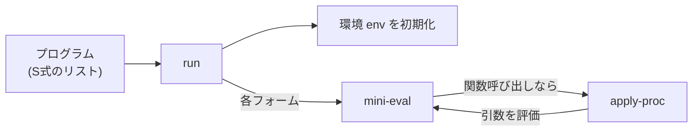

# 第 14 章 小さな Lisp 処理系を作る — ハンズオン 2

Lisp を学んだら、**一度は Lisp を Lisp で書いてみる** のが最高の理解法です。Peter Norvig の "Lispy" 系記事でも有名な古典ハンズオンを、日本語で丁寧に追体験しましょう。

完成形のソースは `examples/ch14/mini-lisp.rkt` にあります。本章を読みながら自分でも 1 行ずつ写経していくと、**「言語処理系って実はこの程度の量で作れる」** という感覚が掴めます。

## 14.1 どこまで作るか

以下を扱う mini-lisp を作ります。

- 数値 / 真偽値 / 文字列 / シンボル
- `define` によるトップレベル束縛(関数・値両方)
- `lambda` による無名関数とクロージャ
- `if`, `let`, `quote`
- 算術: `+ - * / = < >`
- リスト: `cons car cdr list null?`
- 再帰を含む任意のユーザ定義関数

末尾呼び出し最適化やマクロは対象外にします(章末で拡張のヒントを示します)。

## 14.2 全体像

処理系の流れは以下の通り。Racket のリーダに S式の読み取りは任せるので、**評価だけ自作** します。



評価器 `mini-eval` は「**式** と **環境** を受け取って値を返す関数」です。Lisp インタプリタの王道設計です。

## 14.3 環境の設計

他言語のインタプリタでも登場する概念。「変数名 → 値」のマップで、**局所スコープを積み重ねる** ために複数フレームを持ちます。

mini-lisp では 2 段構成にします。

- **局所フレーム**: `let` や関数呼び出しで増える。連想リストのスタック。
- **グローバル**: `define` の結果。ハッシュマップで可変。

なぜ 2 段かというと、**相互再帰関数** が動くようにするためです。`(define (fact n) ...)` のクロージャは環境を保持しますが、その環境が自分自身を含むには、グローバルが mutable である必要があります。

```racket
(struct env (frames globals) #:transparent)

(define (make-root-env)
  (define g (make-hash))
  (hash-set*! g
              '+ + '- - '* * '/ /
              '= = '< < '> >
              'cons cons 'car car 'cdr cdr 'list list
              'null? null? 'not not)
  (env '() g))
```

組み込み手続きは最初から `globals` に入れておきます。`+` というシンボルに Racket の `+` 関数を束縛する形。

環境の拡張・検索は以下。

```racket
(define (extend-env e names values)
  (env (cons (map cons names values) (env-frames e))
       (env-globals e)))

(define (env-set-global! e name value)
  (hash-set! (env-globals e) name value))

(define (env-lookup e sym)
  (let loop ([frames (env-frames e)])
    (cond
      [(null? frames)
       (hash-ref (env-globals e) sym
                 (lambda () (error 'lookup "unbound: ~v" sym)))]
      [(assoc sym (car frames)) => cdr]
      [else (loop (cdr frames))])))
```

`cond` の `=>` は「述語が真なら、その結果を関数として呼ぶ」の構文。`(assoc sym frame) => cdr` は `(cdr (assoc sym frame))` を返すと読みます。

## 14.4 評価器の骨格

```racket
(define (mini-eval expr e)
  (match expr
    [(? number?)   expr]
    [(? boolean?)  expr]
    [(? string?)   expr]
    [(? symbol?)   (env-lookup e expr)]
    [(list 'quote datum) datum]
    [(list 'if c a b)
     (if (mini-eval c e)
         (mini-eval a e)
         (mini-eval b e))]
    [(list* 'lambda params body)
     (list 'closure params body e)]
    [(list* 'let bindings body)
     (define names (map car  bindings))
     (define vals  (map (lambda (b) (mini-eval (cadr b) e)) bindings))
     (eval-body body (extend-env e names vals))]
    [(cons f args)
     (apply-proc (mini-eval f e)
                 (map (lambda (a) (mini-eval a e)) args))]))
```

評価器が `match` でほぼ **表の形** に書けているのが Lisp の美しさです。それぞれの節を読み解きます。

### (? number?) / (? boolean?) / (? string?)

「数値・真偽値・文字列はそれ自身が値」(自己評価式)。

### (? symbol?)

シンボルは **変数名**。環境を引いて値を返します。

### `(list 'quote datum)`

`'(+ 1 2)` のようなリテラル。評価せずそのまま値として返します。

### `(list 'if c a b)`

条件分岐。`c` を評価し、結果で `a` か `b` のどちらかだけを評価。

### `(list* 'lambda params body)`

関数リテラル。**評価時点の環境 `e` を閉じ込めて** 4 要素のタグ付きリストを返します。これが **クロージャの実装** です。

`list*` は `list` + `cons` を混ぜたような記法で、`(list* 'lambda params body)` は `(cons 'lambda (cons params body))` と等価です。`body` が複数式を含むリストとしてマッチします。

### `(list* 'let bindings body)`

局所束縛。束縛式を **現在の環境** で評価してから、新しいフレームを積んで本体を評価します。

### `(cons f args)`

これが **通常の関数呼び出し**。`f` も `args` もすべて評価してから `apply-proc` に渡します。

`match` の節は **上から順** にチェックされるので、特殊フォーム(`if`, `lambda`, ...)の方を先に書くのが要点です。

## 14.5 関数適用

```racket
(define (apply-proc proc args)
  (match proc
    [(list 'closure params body captured-env)
     (eval-body body (extend-env captured-env params args))]
    [(? procedure?)
     (apply proc args)]
    [else (error 'apply "not a procedure: ~v" proc)]))

(define (eval-body exprs e)
  (cond
    [(null? (cdr exprs)) (mini-eval (car exprs) e)]
    [else
     (mini-eval (car exprs) e)
     (eval-body (cdr exprs) e)]))
```

- ユーザ定義関数は `('closure params body env)` の形。束縛を拡張して本体を評価。
- 組み込み関数は Racket 側の関数そのものなので、`apply` で呼ぶだけ。

## 14.6 トップレベル `run`

```racket
(define (run program)
  (define e (make-root-env))
  (for/last ([form (in-list program)])
    (match form
      [(list 'define (cons name params) body ...)
       (env-set-global! e name
                        (mini-eval `(lambda ,params ,@body) e))
       (void)]
      [(list 'define name expr)
       (env-set-global! e name (mini-eval expr e))
       (void)]
      [else (mini-eval form e)])))
```

- `(define (f x) ...)` と `(define f ...)` の 2 形をサポート
- 関数定義は内部的には「名前に lambda を束縛するだけ」
- `for/last` は最後に評価した値を返すので、プログラムの最後の式の値が結果になる

## 14.7 動作確認

```racket
(define program
  '((define (square x) (* x x))
    (define (fact n)
      (if (< n 2) 1 (* n (fact (- n 1)))))
    (define (my-map f xs)
      (if (null? xs) '()
          (cons (f (car xs)) (my-map f (cdr xs)))))
    (list (square 7)
          (fact 6)
          (my-map square '(1 2 3 4 5)))))

(run program)
```

実行:

```text
$ racket examples/ch14/mini-lisp.rkt
(49 720 (1 4 9 16 25))
```

`square`、再帰版 `fact`、`my-map` が mini-lisp 内で動いています。組み込みの `map` は提供していないのに、`my-map` をユーザ定義で書くと普通に動く。これが **関数とクロージャだけで言語を構築する** Lisp の醍醐味です。

### テストも通る

```text
$ raco test examples/ch14/mini-lisp.rkt
raco test: (submod ".../mini-lisp.rkt" test)
5 tests passed
```

## 14.8 デバッグ用:環境の可視化

どんなプログラムで何が起きたか追いたくなったら、`mini-eval` の冒頭で環境とフォームを表示すればいい。これが自作処理系の強みです。

```racket
(define (mini-eval expr e)
  (printf "EVAL ~v  env=~v~n" expr (take-at-most (env-frames e) 2))
  ...)
```

本物の Racket のデバッガは複雑ですが、自作のインタプリタなら **1 行で計測ポイントを差し込める**。これは学習用 DSL の最大の利点です。

## 14.9 よくあるバグと対策

### クロージャが再帰しない

今回の設計では `env-globals` を **共有の可変ハッシュ** にすることで解決しました。もし純粋な不変リストで環境を積むと、クロージャ作成時点の環境に自分自身が入っていないので、再帰呼び出しが `unbound: fact` で失敗します。

### `let` と `let*` の違い

mini-lisp の `let` は「束縛式を **現在の環境** で評価」なので、同時束縛です。`let*` を追加するには新しいフレームを各束縛ごとに積めばよい(練習問題)。

### 特殊フォームの順序

`cond` や `match` の節は上から順にチェックされるので、**特殊フォームを通常呼び出しより先に書かないといけません**。`(list* 'lambda ...)` を後ろに書くと `lambda` という名前の関数呼び出しとして解釈されてエラーになります。

## 14.10 拡張のヒント

自分で追加してみると面白い項目です。

### 易しめ

1. `cond` / `when` / `unless` を特殊フォームとして追加
2. `=`, `<=`, `>=` を組み込みに追加
3. `set!` による変数の再代入
4. `let*` と `letrec`
5. エラー時のトレース(どの関数呼び出しで起きたか)
6. 標準入出力 (`display`, `read`)

### 難しめ

1. 末尾呼び出し最適化(CPS 変換 / トランポリン)
2. `call/cc` を最小実装
3. マクロ(`define-syntax`)
4. 型推論

### 挑戦

- 自作 mini-lisp 自身のインタプリタを mini-lisp で書く(メタサーキュラーインタプリタ)

## 14.11 まとめ

- インタプリタは `match` + 環境 + 評価器の 3 本柱
- クロージャは「λ 体 + 定義時環境」の 4 要素タプル
- グローバルを可変にすると相互再帰が自然に動く
- 300 行に満たないコードで **言語がちゃんと動く**
- 自分で書いた言語は自分でデバッグできる = 最高の学習教材

---

## 手を動かしてみよう

1. mini-lisp に `cond` を追加しなさい。
   ```racket
   [(list* 'cond clauses)
    (let loop ([cs clauses])
      (cond
        [(null? cs) (void)]
        [(eq? (caar cs) 'else) (eval-body (cdar cs) e)]
        [(mini-eval (caar cs) e) (eval-body (cdar cs) e)]
        [else (loop (cdr cs))]))]
   ```
   `mini-eval` に上の節を追加して、以下が動くことを確認。
   ```racket
   (run '((define (classify n)
            (cond
              [(= n 0) 'zero]
              [(< n 0) 'negative]
              [else 'positive]))
          (list (classify -1) (classify 0) (classify 5))))
   ;; => (negative zero positive)
   ```

2. mini-lisp に `set!` を追加しなさい。局所フレームの連想リストを破壊的に書き換える必要があるため、データ構造を `mcons` / `mpair?` に変える設計検討が良い練習になります。

3. 以下の mini-lisp プログラムがちゃんと動くことを確認しなさい。
   ```racket
   (run '((define (compose f g) (lambda (x) (f (g x))))
          (define (inc x) (+ x 1))
          (define (sq  x) (* x x))
          ((compose sq inc) 4)))
   ;; => 25
   ```
   関数を返す関数 `compose` が高階関数として使えている感動を噛み締めてください。

次章では、mini-lisp の代わりに **Web アプリ** を作って、ブラウザ越しに遊べる形に仕上げます。
